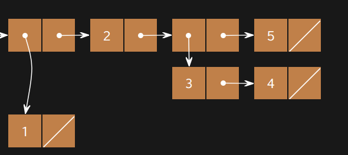

### Q2: Over or Under

Define a procedure `over-or-under` which takes in a number `num1` and a number `num2` and returns the following:

- -1 if `num1` is less than `num2`
- 0 if `num1` is equal to `num2`
- 1 if `num1` is greater than `num2`

```scheme
(define (over-or-under num1 num2)
  (cond
    ((< num1 num2) -1)
    ((= num1 num2) 0)
    ((> num1 num2) 1))
)
```

### Q3: Filter Lst

Write a procedure `filter-lst`, which takes a predicate `fn` and a list `lst`, and returns a new list containing only elements of the list that satisfy the predicate. The output should contain the elements in the same order that they appeared in the original list.

```scheme
(define (filter-lst fn lst)
  (cond
    ((= (length lst) 0) nil)
    ((fn (car lst)) (cons (car lst) (filter-lst fn (cdr lst))))
    (else (filter-lst fn (cdr lst)))
    )
)
```

### Q4: Make Adder

Write the procedure `make-adder` which takes in an initial number, `num`, and then returns a procedure. This returned procedure takes in a number `inc` and returns the result of `num + inc`.

*Hint*: To return a procedure, you can either return a `lambda` expression or `define` another nested procedure. Remember that Scheme will automatically return the last clause in your procedure.

```scheme
(define (make-adder num)
  (lambda (inc) (+ num inc))
)
```

# Optional Questions

> The following questions are for **extra practice**. However, they are in scope and we recommend you do them if you have time.

### Q5: Make a List

Create the list with the following box-and-pointer diagram:



```scheme
(define lst
  (list (list 1) 2 (list 3 4) 5)
)
```

### Q6: Compose

Write the procedure `composed`, which takes in procedures `f` and `g` and outputs a new procedure. This new procedure takes in a number `x` and outputs the result of calling `f` on `g` of `x`.

```scheme
(define (composed f g)
  (lambda (x) (f (g x)))
)
```

### Q7: Remove

Implement a procedure `remove` that takes in a list and returns a new list with *all* instances of `item` removed from `lst`. You may assume the list will only consist of numbers and will not have nested lists.

*Hint*: You might find the `filter-lst` procedure useful.

```scheme
(define (remove item lst)
  (filter-lst (lambda (x) (not (= x item))) lst)
)
```

### Q8: No Repeats

Implement `no-repeats`, which takes a list of numbers `s` as input and returns a list that has all of the unique elements of `s` in the order that they first appear, but no repeats. For example, `(no-repeats (list 5 4 5 4 2 2))` evaluates to `(5 4 2)`.

*Hints*: To test if two numbers are equal, use the `=` procedure. To test if two numbers are not equal, use the `not` procedure in combination with `=`. You may find it helpful to use the `filter-lst` procedure.

```scheme
(define (no-repeats s)
  (if (= (length s) 0) 
    nil
    (cons
        (car s)
        (no-repeats (remove (car s) (cdr s)))
    )
  )
)
```

### Q9: Substitute

Write a procedure `substitute` that takes three arguments: a list `s`, an `old` word, and a `new` word. It returns a list with the elements of `s`, but with every occurrence of `old` replaced by `new`, even within sub-lists.

*Hint*: The built-in `pair?` predicate returns True if its argument is a `cons` pair.

*Hint*: The `=` operator will only let you compare numbers, but using `equal?` or `eq?` will let you compare symbols as well as numbers. For more information, check out the [Scheme Built-in Procedure Reference](https://inst.eecs.berkeley.edu/~cs61a/su20/articles/scheme-builtins.html#boolean-operations).

```scheme
(define (substitute s old new)
  (cond
    ((eq? s nil) nil)
    ((pair? (car s)) 
      (cons (substitute (car s) old new) (substitute (cdr s) old new)))
    ((eq? old (car s)) (cons new (substitute (cdr s) old new)))
    (else (cons (car s) (substitute (cdr s) old new)))
  )
)
```

### Q10: Sub All

Write `sub-all`, which takes a list `s`, a list of `old` words, and a list of `new` words; the last two lists must be the same length. It returns a list with the elements of `s`, but with each word that occurs in the second argument replaced by the corresponding word of the third argument. You may use `substitute` in your solution. Assume that `olds` and `news` have no elements in common.

```scheme
(define (sub-all s olds news)
  (if (= (length olds) 0) 
    s
    (sub-all (substitute s (car olds) (car news)) (cdr olds) (cdr news))
  )
)
```

