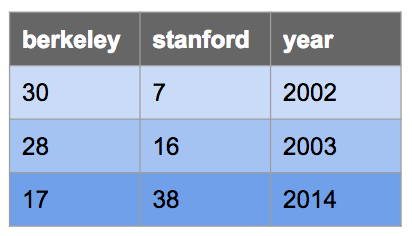

# Lab 13: SQL

*Due by 11:59pm on Friday, August 7.*

## Starter Files

Download [lab13.zip](https://inst.eecs.berkeley.edu/~cs61a/su20/lab/lab13/lab13.zip). Inside the archive, you will find starter files for the questions in this lab, along with a copy of the [Ok](https://inst.eecs.berkeley.edu/~cs61a/su20/lab/lab13/ok) autograder.

## Submission

By the end of this lab, you should have submitted the lab with `python3 ok --submit`. You may submit more than once before the deadline; only the final submission will be graded. Check that you have successfully submitted your code on [okpy.org](https://okpy.org/).

# Topics

Consult this section if you need a refresher on the material for this lab, or if you're having trouble running SQL or SQLite on your computer. It's okay to skip directly to [the questions](https://inst.eecs.berkeley.edu/~cs61a/su20/lab/lab13/#required-questions) and refer back here should you get stuck.

SQL Basics

## SQL Basics

### Creating Tables

You can create SQL tables either from scratch or from existing tables.

The following statement creates a table by specifying column names and values without referencing another table. Each `SELECT` clause specifies the values for one row, and `UNION` is used to join rows together. The `AS` clauses give a name to each column; it need not be repeated in subsequent rows after the first.

```
CREATE TABLE [table_name] AS
  SELECT [val1] AS [column1], [val2] AS [column2], ... UNION
  SELECT [val3]             , [val4]             , ... UNION
  SELECT [val5]             , [val6]             , ...;
```

Let's say we want to make the following table called `big_game` which records the scores for the Big Game each year. This table has three columns: `berkeley`, `stanford`, and `year`.



We could do so with the following `CREATE TABLE` statement:

```
CREATE TABLE big_game AS
  SELECT 30 AS berkeley, 7 AS stanford, 2002 AS year UNION
  SELECT 28,             16,            2003         UNION
  SELECT 17,             38,            2014;
```

### Selecting From Tables

More commonly, we will create new tables by selecting specific columns that we want from existing tables by using a `SELECT` statement as follows:

```
SELECT [columns] FROM [tables] WHERE [condition] ORDER BY [columns] LIMIT [limit];
```

Let's break down this statement:

- `SELECT [columns]` tells SQL that we want to include the given columns in our output table; `[columns]` is a comma-separated list of column names, and `*` can be used to select all columns
- `FROM [table]` tells SQL that the columns we want to select are from the given table; see the [joins section](https://inst.eecs.berkeley.edu/~cs61a/su20/lab/lab13/) to see how to select from multiple tables
- `WHERE [condition]` filters the output table by only including rows whose values satisfy the given `[condition]`, a boolean expression
- `ORDER BY [columns]` orders the rows in the output table by the given comma-separated list of columns
- `LIMIT [limit]` limits the number of rows in the output table by the integer `[limit]`

> *Note:* We capitalize SQL keywords purely because of style convention. It makes queries much easier to read, though they will still work if you don't capitalize keywords.

Here are some examples:

Select all of Berkeley's scores from the `big_game` table, but only include scores from years past 2002:

```
sqlite> SELECT berkeley FROM big_game WHERE year > 2002;
28
17
```

Select the scores for both schools in years that Berkeley won:

```
sqlite> SELECT berkeley, stanford FROM big_game WHERE berkeley > stanford;
30|7
28|16
```

Select the years that Stanford scored more than 15 points:

```
sqlite> SELECT year FROM big_game WHERE stanford > 15;
2003
2014
```

### SQL operators

Expressions in the `SELECT`, `WHERE`, and `ORDER BY` clauses can contain one or more of the following operators:

- comparison operators: `=`, `>`, `<`, `<=`, `>=`, `<>` or `!=` ("not equal")
- boolean operators: `AND`, `OR`
- arithmetic operators: `+`, `-`, `*`, `/`
- concatenation operator: `||`

Here are some examples:

Output the ratio of Berkeley's score to Stanford's score each year:

```
sqlite> select berkeley * 1.0 / stanford from big_game;
0.447368421052632
1.75
4.28571428571429
```

Output the sum of scores in years where both teams scored over 10 points:

```
sqlite> select berkeley + stanford from big_game where berkeley > 10 and stanford > 10;
55
44
```

Output a table with a single column and single row containing the value "hello world":

```
sqlite> SELECT "hello" || " " || "world";
hello world
```

Joins

## Joins

To select data from multiple tables, we can use joins. There are many types of joins, but the only one we'll worry about is the inner join. To perform an inner join on two on more tables, simply list them all out in the `FROM` clause of a `SELECT` statement:

```
SELECT [columns] FROM [table1], [table2], ... WHERE [condition] ORDER BY [columns] LIMIT [limit];
```

We can select from multiple different tables or from the same table multiple times.

Let's say we have the following table that contains the names head football coaches at Cal since 2002:

```
CREATE TABLE coaches AS
  SELECT "Jeff Tedford" AS name, 2002 as start, 2012 as end UNION
  SELECT "Sonny Dykes"         , 2013         , 2016        UNION
  SELECT "Justin Wilcox"       , 2017         , null;
```

When we join two or more tables, the default output is a [cartesian product](https://en.wikipedia.org/wiki/Cartesian_product). For example, if we joined `big_game` with `coaches`, we'd get the following:


If we want to match up each game with the coach that season, we'd have to compare columns from the two tables in the `WHERE` clause:

```
sqlite> SELECT * FROM big_game, coaches WHERE year >= start AND year <= end;
17|38|2014|Sonny Dykes|2013|2016
28|16|2003|Jeff Tedford|2002|2012
30|7|2002|Jeff Tedford|2002|2012
```

The following query outputs the coach and year for each Big Game win recorded in `big_game`:

```
sqlite> SELECT name, year FROM big_game, coaches
...>        WHERE berkeley > stanford AND year >= start AND year <= end;
Jeff Tedford|2003
Jeff Tedford|2002
```

In the queries above, none of the column names are ambiguous. For example, it is clear that the `name` column comes from the `coaches` table because there isn't a column in the `big_game` table with that name. However, if a column name exists in more than one of the tables being joined, or if we join a table with itself, we must disambiguate the column names using *aliases*.

For examples, let's find out what the score difference is for each team between a game in `big_game` and any previous games. Since each row in this table represents one game, in order to compare two games we must join `big_game` with itself:

```
sqlite> SELECT b.Berkeley - a.Berkeley, b.Stanford - a.Stanford, a.Year, b.Year
...>        FROM big_game AS a, big_game AS b WHERE a.Year < b.Year;
-11|22|2003|2014
-13|21|2002|2014
-2|9|2002|2003
```

In the query above, we give the alias `a` to the first `big_game` table and the alias `b` to the second `big_game` table. We can then reference columns from each table using dot notation with the aliases, e.g. `a.Berkeley`, `a.Stanford`, and `a.Year` to select from the first table.


Troubleshooting

## Troubleshooting

Python already comes with a built-in SQLite database engine to process SQL. However, it doesn't come with a "shell" to let you interact with it from the terminal. Because of this, until now, you have been using a simplified SQLite shell written by us. However, you may find the shell is old, buggy, or lacking in features. In that case, you may want to download and use the official SQLite executable.

If running `python3 sqlite_shell.py` didn't work, you can download a precompiled sqlite directly by following the following instructions and then use `sqlite3` and `./sqlite3` instead of `python3 sqlite_shell.py` based on which is specified for your platform.

Another way to start using SQLite is to download a precompiled binary from the [SQLite website](http://www.sqlite.org/download.html). The latest version of SQLite at the time of writing is 3.28.0, but you can check for additional updates on the website.

However, before proceeding, please remove (or rename) any SQLite executables (`sqlite3`, `sqlite_shell.py`, and the like) from the current folder, or they may conflict with the official one you download below. Similarly, if you wish to switch back later, please remove or rename the one you downloaded and restore the files you removed.

### Windows

1. Visit the download page linked above and navigate to the section Precompiled Binaries for Windows. Click on the link **sqlite-tools-win32-x86-\*.zip** to download the binary.

2. Unzip the file. There should be a `sqlite3.exe` file in the directory after extraction.

3. Navigate to the folder containing the `sqlite3.exe` file and check that the version is at least 3.8.3:

   ```
   $ cd path/to/sqlite
   $ ./sqlite3 --version
   3.12.1 2016-04-08 15:09:49 fe7d3b75fe1bde41511b323925af8ae1b910bc4d
   ```

### macOS Yosemite (10.10) or newer

SQLite comes pre-installed. Check that you have a version that's greater than 3.8.3:

```
    $ sqlite3
    SQLite version 3.8.10.2
```

### Mac OS X Mavericks (10.9) or older

SQLite comes pre-installed, but it is the wrong version.

1. Visit the download page linked above and navigate to the section **Precompiled Binaries for Mac OS X (x86)**. Click on the link **sqlite-tools-osx-x86-\*.zip** to download the binary.

2. Unzip the file. There should be a `sqlite3` file in the directory after extraction.

3. Navigate to the folder containing the `sqlite3` file and check that the version is at least 3.8.3:

   ```
   $ cd path/to/sqlite
   $ ./sqlite3 --version
   3.12.1 2016-04-08 15:09:49 fe7d3b75fe1bde41511b323925af8ae1b910bc4d
   ```

### Ubuntu

The easiest way to use SQLite on Ubuntu is to install it straight from the native repositories (the version will be slightly behind the most recent release):

```
$ sudo apt install sqlite3
$ sqlite3 --version
3.8.6 2014-08-15 11:46:33 9491ba7d738528f168657adb43a198238abde19e
```

SQLite Usage

## Usage

First, check that a file named `sqlite_shell.py` exists alongside the assignment files. If you don't see it, or if you encounter problems with it, scroll down to the Troubleshooting section to see how to download an official precompiled SQLite binary before proceeding.

You can start an interactive SQLite session in your Terminal or Git Bash with the following command:

```
python3 sqlite_shell.py
```

While the interpreter is running, you can type `.help` to see some of the commands you can run.

To exit out of the SQLite interpreter, type `.exit` or `.quit` or press `Ctrl-C`. Remember that if you see `...>` after pressing enter, you probably forgot a `;`.

You can also run all the statements in a `.sql` file by doing the following:

1. Runs your code and then exits SQLite immediately afterwards.

   ```
   python3 sqlite_shell.py < lab13.sql
   ```

2. Runs your code and then opens an interactive SQLite session, which is similar to running Python code with the interactive `-i` flag.

   ```
   python3 sqlite_shell.py --init lab13.sql
   ```

### Q2: Go Bears! (And Dogs?)

```sql
CREATE TABLE bluedog AS
  SELECT color, pet from students where color = "blue" and pet = "dog";

CREATE TABLE bluedog_songs AS
  SELECT color, pet, song from students where color = "blue" and pet = "dog";
```

### Q3: Matchmaker, Matchmaker

Did you take 61A with the hope of finding your quarantine romance? Well you're in luck! With all this data in hand, it's easy for us to find your perfect match. If two students want the same pet and have the same taste in music, they are clearly meant to be together! In order to provide some more information for the potential lovebirds to converse about, let's include the favorite colors of the two individuals as well!

In order to match up students, you will have to do a join on the `students` table with itself. When you do a join, SQLite will match every single row with every single other row, so make sure you do not match anyone with themselves, or match any given pair twice!

> **Important Note:** When pairing the first and second person, make sure that the first person responded first (i.e. they have an earlier `time`). This is to ensure your output matches our tests.
>
> *Hint:* When joining table names where column names are the same, use dot notation to distinguish which columns are from which table: `[table_name].[column name]`. This sometimes may get verbose, so it’s stylistically better to give tables an alias using the `AS` keyword. The syntax for this is as follows:
>
> ```
> SELECT <[alias1].[column name1], [alias2].[columnname2]...>
>     FROM <[table_name1] AS [alias1],[table_name2] AS [alias2]...> ...
> ```
>
> The query in the [football example](https://inst.eecs.berkeley.edu/~cs61a/su20/lab/lab13/#joins) from earlier uses this syntax.

Write a SQL query to create a table that has 4 columns:

- The shared preferred `pet` of the couple
- The shared favorite `song` of the couple
- The favorite `color` of the first person
- The favorite `color` of the second person

```sql
CREATE TABLE matchmaker AS
  SELECT a.pet, a.song, a.color, b.color from students as a, students as b 
    where a.pet == b.pet and a.song == b.song and a.time < b.time;
```

### Q4: Sevens

Let's take a look at data from both of our tables, `students` and `numbers`, to find out if students that really like the number 7 also chose `'7'` for the obedience question. Specifically, we want to look at the students that fulfill the below conditions and see if they also chose `'7'` in the question that asked students to choose the number 7 (column `seven` in `students`).

Conditions:

- reported that their favorite number (column `number` in `students`) was 7
- have `'True'` in column `'7'` in `numbers`, meaning they checked the number `7` during the survey

In order to examine rows from both the `students` and the `numbers` table, we will need to perform a join.

How would you specify the `WHERE` clause to make the `SELECT` statement only consider rows in the joined table whose values all correspond to the same student? If you find that your output is massive and overwhelming, then you are probably missing the necessary condition in your `WHERE` clause to ensure this.

> *Note:* The columns in the `numbers` table are strings with the associated number, so you must put quotes around the column name to refer to it. For example if you alias the table as `a`, to get the column to see if a student checked 9001, you must write `a.'9001'`.

Write a SQL query to create a table with just the column `seven` from `students`, filtering first for students who said their favorite number (column `number`) was 7 in the `students` table and who checked the box for seven (column `'7'`) in the `numbers` table.

```
CREATE TABLE sevens AS
  SELECT "REPLACE THIS LINE WITH YOUR SOLUTION";
```

```python
CREATE TABLE sevens AS
  SELECT students.seven from students, numbers where students.time == numbers.time 
    and students.number == 7 and numbers.'7' == "True";

```

### Q5: Let's Count

Using COUNT and ORDER BY

How many people liked each pet? What is the biggest date chosen this semester? How many obedient people chose Image 1 for the instructor? Is there a difference between last semester's average favorite number and this semester's?

To answer these types of questions, we can bring in SQL aggregation, which allows us to accumulate values across rows in our SQL database!

In order to perform SQL aggregation, we can group rows in our table by one or more attributes. Once we have groups, we can aggregate over the groups in our table and find things like:

- the maximum value (`MAX`),
- the minimum value (`MIN`),
- the number of rows in the group (`COUNT`),
- the average over all of the values (`AVG`),

and more! `SELECT` statements that use aggregation are usually marked by two things: an aggregate function (`MAX`, `MIN`, `COUNT`, `AVG`, etc.) and a `GROUP BY` clause. `GROUP BY [column(s)]` groups together rows with the same value in each column(s). In this section we will only use `COUNT`, which will count the number of rows in each group, but feel free to check out [this link](http://www.sqlcourse2.com/agg_functions.html) for more!

For example, the following query will print out the top 10 favorite numbers with their respective counts (yes, you are all hilarious):

```
sqlite> SELECT number, COUNT(*) AS count FROM students GROUP BY number ORDER BY count DESC LIMIT 10;
69|14
24|8
8|8
7|7
2|7
42|5
17|5
11|5
27|4
16|4
```

This `SELECT` statement first groups all of the rows in our table `students` by `number`. Then, within each group, we perform aggregation by `COUNT`ing all the rows. By selecting `number` and `COUNT(*)`, we then can see the highest `number` and how many students picked that number. We have to order by our `COUNT(*)`, which is saved in the alias `count`, by `DESC`ending order, so our highest count starts at the top, and we limit our result to the top 10.

You can then add `ORDER BY column` to the end of any query to sort the results by that column, in ascending order (or, with the parameter `DESC` you can sort in descending order instead, as above).


Let's have some fun with `COUNT` and `ORDER BY`! For each query below, we created its own table in `lab13.sql`, so fill in the corresponding table and run it using Ok.


```sql
CREATE TABLE favpets AS
  SELECT pet, count(*) as count from students group by pet order by count DESC limit 10;

CREATE TABLE dog AS
  SELECT pet, count(*) from students where pet == "dog";


CREATE TABLE bluedog_agg AS
  SELECT song, count(*) as count from bluedog_songs group by song order by count DESC;


CREATE TABLE instructor_obedience AS
  SELECT seven, instructor, count(*) from students where seven = '7' group by instructor;
```

