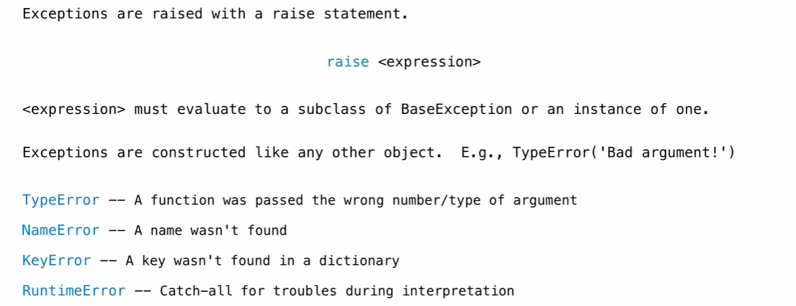
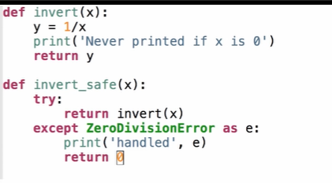

## Assert

```python
def fact(x):
    assert isinstance(x, int)
    assert x >= 0
    if x == 0:
        return 1
    else:
        return x * fact(x - 1)
    
def half_fact(x):
    return face(x / 2)
```

Assertions: Limitations

- Require invariants
  - Assertions tend to be useful when you know a good invariant
  - An invariant is something that is always true
  - E.g., the argument to fact being a non-negative integer
  
- Assertions check that code meets an existing understanding 

  - They are less useful at actually developing an understanding of how some code is working
  - Generally, assertions are best added to your own code, not someone else's
  
## Testing

  Testing: Doctests

```bash
python3 -m doctest file.py
```

- Doctests have to be in the file 
- Do not treat print/return differently


## Print Debugging: Why do it?

ok integration

```python
print("Debug: x=", x) 
// ok will process it
```


## Interactive Debugging

```python
python3 -i file.py
python3 ok -q whatever -i
```

pythonTutor

```python
python ok -q whatever --trace
```


## Error Types

- SyntaxError
- IndentationError
- TypeError
- NameError or UnboundLocalError


## Traceback

- Commponents
  - The error message itself
  - Lines #s on the way to the error
  - What's on those lines
- Most recent call is at the bottom


## Exceptions

A built-mechanism in a programming language to declare and respond to exceptional conditions

Python raises an exception whenever an error occurs

Unhandled exceptions will cause Python to halt execution and print a stack trace

**Mastering exceptions**

Exceptions are objects! They have classes with constructors

They enable non-local continuations of control:

If f calls g and g calls h, exceptions can shift control from h to f without waiting for g to return 


## Raising Exceptions

**Assert Statements**

Assert statements raise an exception of type AssertionError

```python
assert <expression>, <string>
```

assertions are designed to be used liberally. They can be ignored to increase efficiency by running Python with the "-o" flag. "o" stands for optimized.

```bash
python3 -o
```

whether assertions are enabled is governed by a bool `__debug__`


**Raise Statements**




## Try Statements

Try statements handle exceptions

```python
try:
    <try suite>
except <exception class> as <name>:
    <except suite>
```


```python
>>> try:
    	x = 1/0
    except ZeroDivisionError as e:
        print('handle a', type(3))
        x = 0
```

