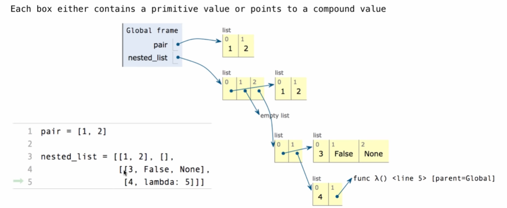

## Box-and-Pointer Notation

The Closure Property of Data Types

- A method for combining data values satisfies the closure property if
  - The result of combination can itself be combined using the same method 
- Closure is powerful because it permits us to create hierarchical structures
- Hierarchical structures are made up of parts, which themselves are made up of parts, and so on




## Slicing

```python
odds[1:3]
odds[:3]
odds[1:]
odd[:]
```

**Slicing Creates New Values**


## Processing Container Values

**Sequence Aggregation**

- sum(iterable, [start=0]) -> value

  ```python
  >>> sum([[2, 3], [4]], [])
  ```

- max(iterable[, func]) -> value

  max(a, b, c, ...[, key = func]) -> value

  With a single iterable argument, return its largest item.

  With two or more arguments, return the largest argument

  ```python
  max(range(10), key=lambda x: 7-(x-4)*(x-2))
  ```

- all(iterable) -> bool

  Return True if bool(x) is True for all values x in the iterable.

  If the iterable is empty, return True.

  ```python
  >>> all([x < 5 for x in range(5)])
  ```


## Trees


**Implementing the Tree Abstraction**


 

## Tree Processing

```python
def fib_tree(n):
    if n <= 1:
        return tree(n)
    else:
        left, right = fib_tree(n-2), fib_tree(n-1)
        return tree(label(left) + label(right), [left, right])
```

```python
def count_leaves(t):
    if is_leaf(t):
        return 1
    else:
        branch_counts = [count_leaves(b) for b in branches(t)]
        return sum(branch_counts)
```


## Printing Trees

 ```python
 def print_tree(t, indent=0):
     print(' ' * indent + str(label(t)))
     for b in branches(t):
         print_tree(b, indent+1)
 ```

