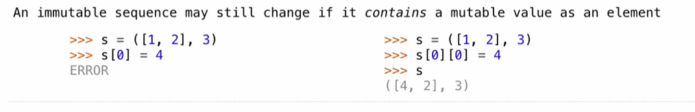

## Objects


- Objects represent information
- They consist of data and behavior, bundled together to create abstractions
- Objects can represent things, but also properties, interactions, & processes
- A type of object is called a class; classes are first-class values in Python
- Object-oriented programming:
  - A metaphor for organizing large programs 
  - Special syntax that can improve the composition of programs
- In Python, every value is an object
  - All objects have attributes
  - A lot of data manipulation happens through object methods
  - Functions do one thing; objects do many related things

## Example: Strings


## Mutable Sequences

**Tuple**

Tuples are sequences, but they are immutable sequences

```python
>>> (3, 4, 5)
(3, 4, 5)
>>> 3, 4, 5, 6
(3, 4, 5, 6)
>>> tuple([3, 4, 5])
(3, 4, 5)
>>> (2,)
(2,)
>>> (3, 4) + (5, 6)
(3, 4, 5, 6)
>>> 5 in (3, 4, 5)
True
```

tuple can be use as a key in dictionary



```python
>>> a = [10]
>>> b = [10]
>>> a == b
True
>>> a is b 
False
```

**Mutable Default Arguments are Dangerous**

A default argument value is part of function value, not generated by a call


