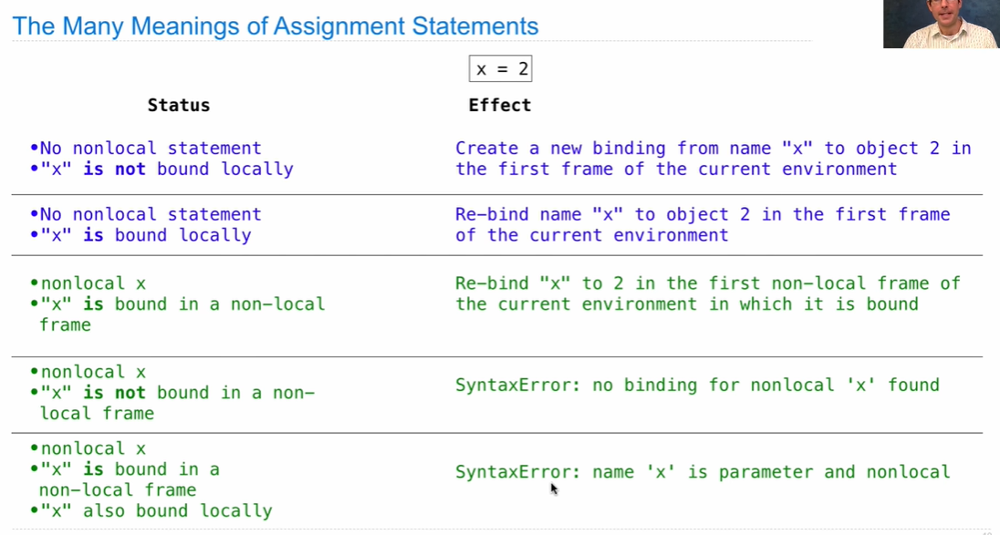
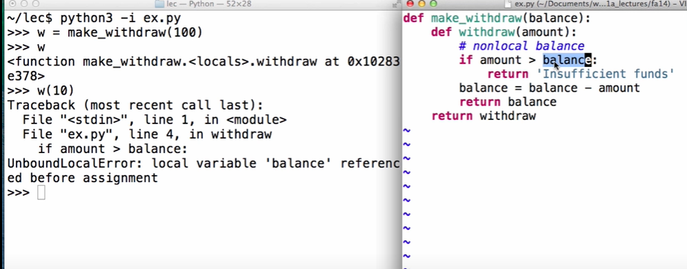
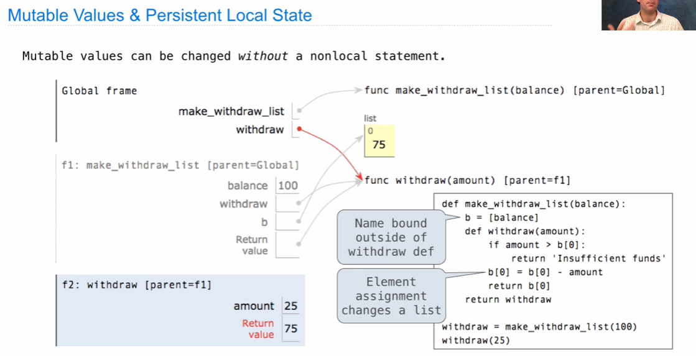
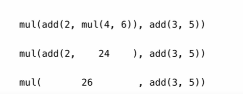
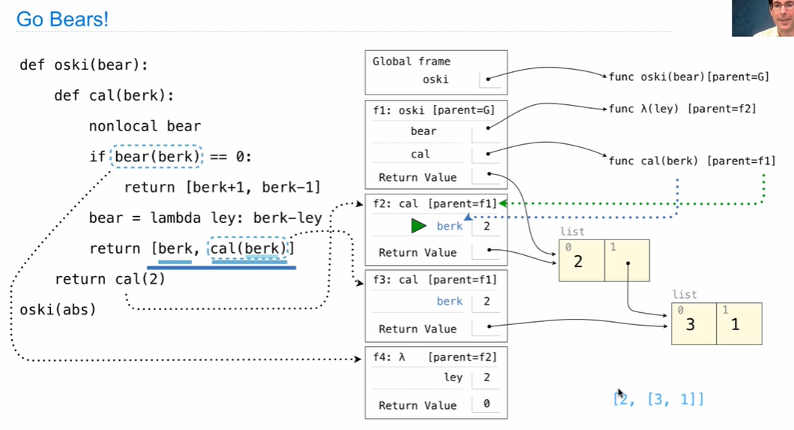

## Mutable Function

A function with behavior that varies over time


The parent frame contains the balance, the local state of the withdraw function.

Every call decreases the same balance by amount

```python
def make_withdraw(balacne):
    def withdraw(amout):
        nonlocal balance // !
        if amount > balance:
            return 'Insufficient funds'
        blance = balance - amount
        return balance
    return withdraw
```


## Non-Local Assignment

`nonlocal <name>`

Effect: Future assignments to that name change its pre-existing binding in the **first non-local frame** of the current environment in which that name is bound.



 Python pre-computes which frame contains each name before executing the body of a function. Within the body of a function, all instances of a name must refer to the same frame.



local assignment to balance and non-local lookup of balance cannot appear in the same function.

**Mutable Values & Persistent Local State**

Mutable values can be changed without a nonlocal statement.




## Multiple Mutable Functions

 Expressions are **referentially transparent** if substituting an expression with its value does not change the meaning of a program



Mutation operations violate the the condition of referential transparency because they do more than just return a value; **they** change the environment



