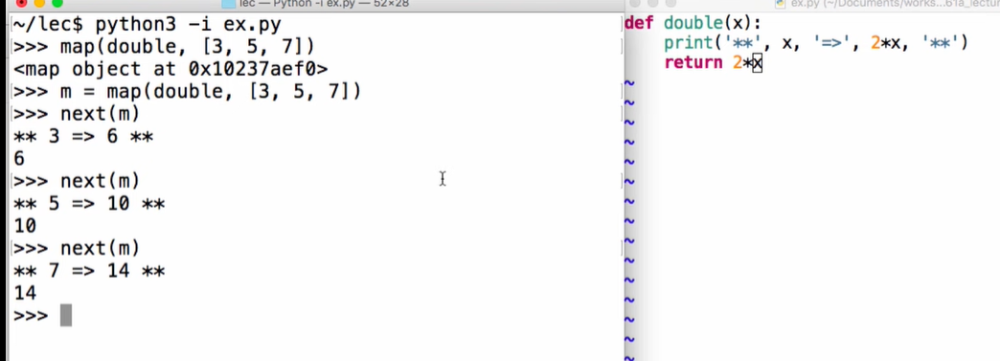
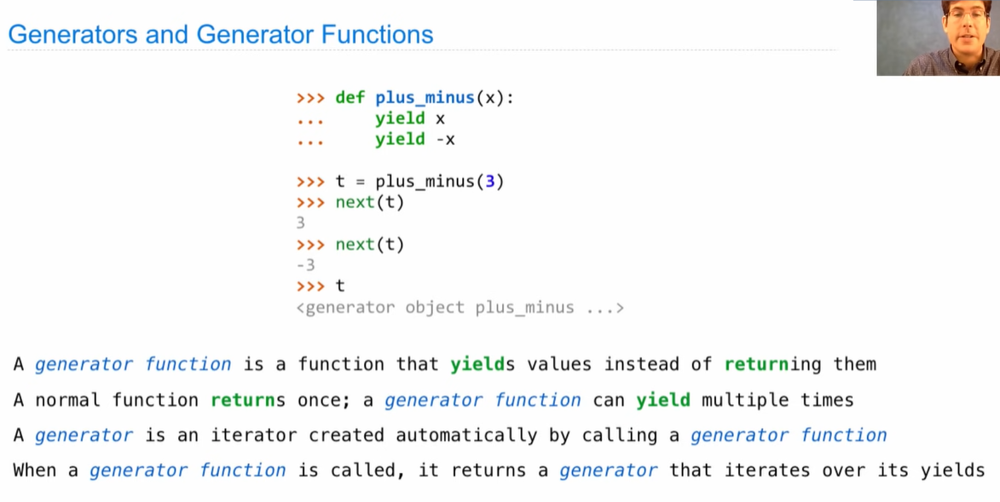
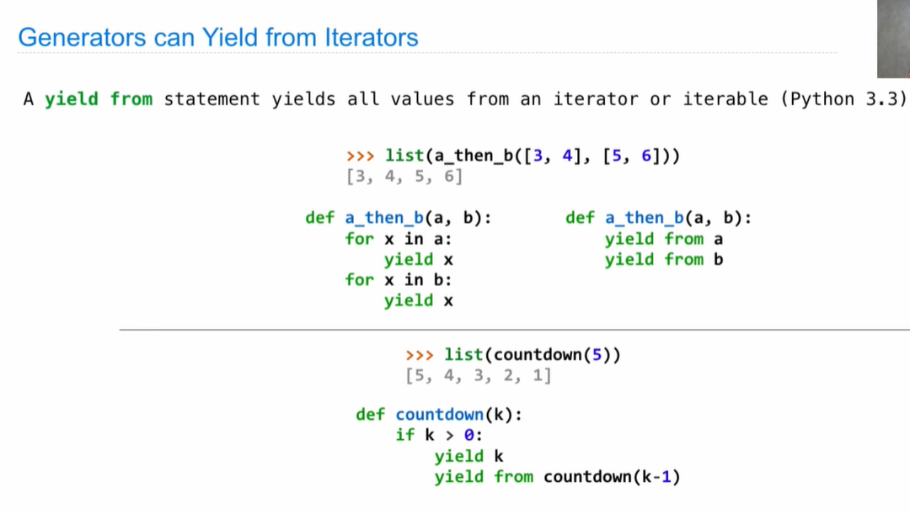
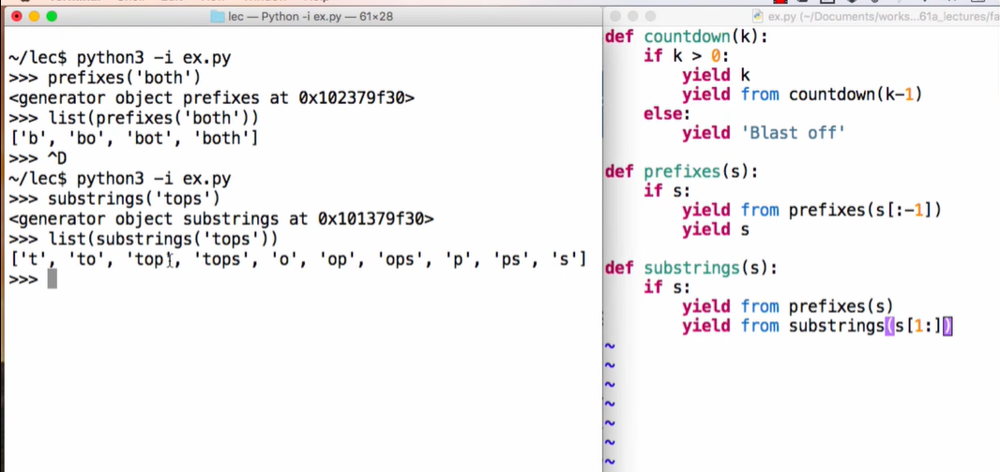

## Iterators

A container can provide an iterator that provides access to its elements in some order

- `iterable`: return an iterator over the elements of an iterable value
- `next(iterator)`: Return the next element in an iterator
- `list(iterator)`: Return all the elements remain

```python
>>> s = [3, 4, 5]
>>> t = iter(s)
>>> next(t)
3
```


## Dictionary

The order of items in a dictionary is the order in which they were added (python 3.6+)

```python
>>> d = {'one': 1, 'two': 2, 'three': 3}
>>> k = iter(d.key())
>>> next(k)
'one'
>>> v = iter(d.values())
1
>>> i = iter(d.items())
>>> next(i)
('one', 1)
```


## For Statements

```python
>>> ri = iter(range(3, 6))
>>> for i in ri:
    	print(i)
```

can't use `ri` again


## Build-In Iterator Functions

Many built-in Python sequence operations return iterators that compute results lazily

- `map(func, iterable)`: Iterator over func(x) for x in iterable
- `filter(func, iterable)`: Iterate over x in iterable if func(x)
- `zip(first_iter, second_iter)`: Iterator over co-indexed (x, y) pairs
- `reversed(sequence)`: Iterator over x in a sequence order

To view the contents of an iterator, place the resulting elements into a container

- `list(iterable)`: Create a list containing all x in iterable
- `tuple(iterable)` Create a tuple containing all x in iterable
- `sorted(iterable):`: Create a sorted list containing x in iterable




## Generators



```python
def evens(start, en):
    even = start + (start % 2)
    while even < end:
        yield even
        even += 2
```


## Generators & Iterators





