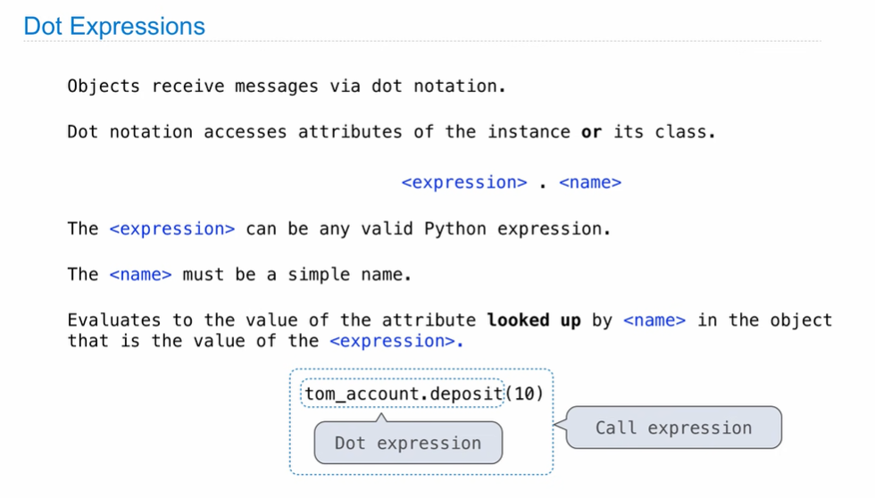
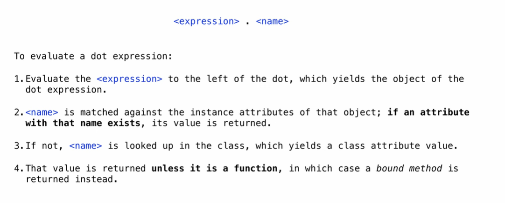
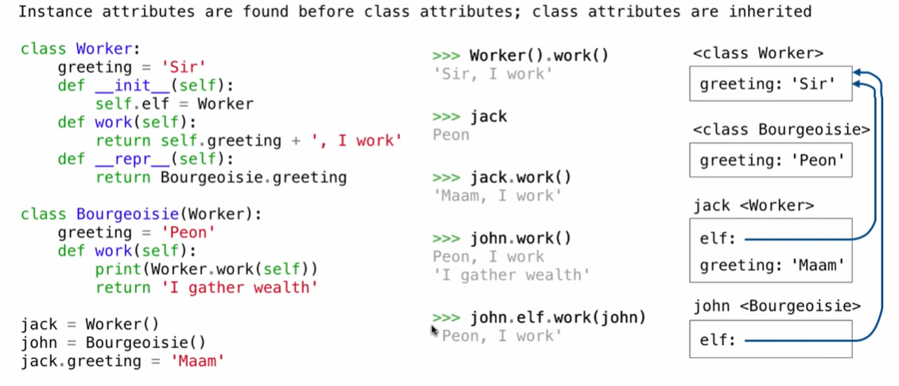

## Object-Oriented Programming

- A method for organizing modular programs
- A metaphor for computation using distributed state
- Specialized syntax & vocabulary to support this metaphor

**Classes**

A class serves as a template for its instances

## Class Statement

```python
class <name>:
    <suite>
```

A class statement creates a new class and binds that class to `<name>` in the first frame of the current environment.

```python
class Clown:
    nose = 'big and red'
    def dance():
        return 'No thanks'
```

**Object Construction**

When a class is called:

1. A new instance of that class is created
2. The `__init__` method of the class is called with the new object as its first argument (named self), along with any additional arguments provided in the call expression.

```python
class Account:
    def __init__(self, account_holder):
        self.balance = 0
        self.holder = account_holder
```

**Object Identity**

Every object that is an instance of a user-defined class has a unique identity:

Binding an object to a new name using assignment does not create a new object

## Methods

```python
class Account:
    def __init__(self, account_holder):
        ...
    def deposit(self, amount):
        self.balance = self.balance + amount
        return self.balance
```

These def statements create function objects as always, but their names are bound as attributes of the class.

**invoking methods**

All invoked methods have access to the object via the self parameter, and so they can all access and manipulate the object's state.

Dot notation automatically supplies the first argument to a method.

**Dot Expressions**



## Attributes

  ```python
  getattr(john, 'balance')
  hasattr(john, 'balance')
  ```

**Accessing Attributes**

getattr and dot expressions look up a name in the same  way

- One of its instance attributes, or 
- One of the attributes of its class

**Methods and Functions**

Object + Function = Bound Method

```python
>>> type(Account.deposit)
<class 'function'>
>>> type(tom_account.deposit)
<class 'method'>
```

```python
>>> Account.deposit(tom_account, 1001)
1011
>>> tom_account.deposit(100)
2011
```




**Class Attributes**

Class attributes are "shared" across all instances of a class because they are attributes of the class, not the instance.



