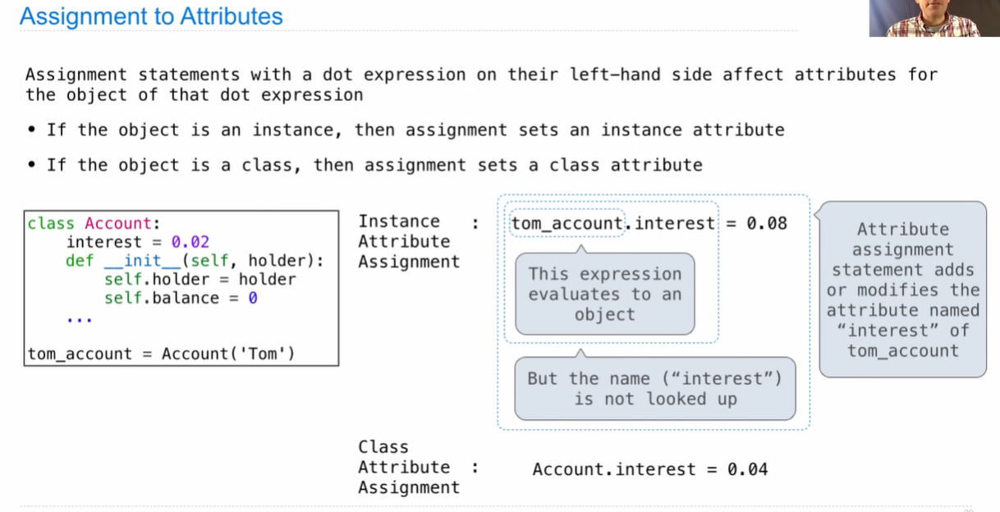

## Attributes


## Attribute Assignment



## Inheritance

Inheritance is a method for relating classes together.

A common use: Two similar classes differ in their degree of specialization.

The specialized class may have the same attributes as the general class, along with some special-case behavior.

```python
class <name>(<base class>):
    <suite>
```


**Looking Up Attribute Names on Classes**

Base class attributes aren't copied into subclasses

To look up a name in a class.

1. If it names an attribute in the class, return the attribute value.
2. Otherwise, look up the name in the base class, if there is one.

## Object-Oriented Design

**Designing for Inheritance**

Don't repeat yourself; use existing implementations

Attributes that have been overridden are still accessible via class objects

Look up attributes on instances whenever possible


**Inheritance and Composition**

Object-oriented programming shines when we adopt the metaphor

Inheritance is best for representing `is-a `relationships

Composition is best for representing `has-a `relationships

```python
class Bank:
    def __init__(self):
        self.accounts = []
    def open_account(self, holder, amound, kind=Account):
        accoutn = kind(holder)
        account.deposit(amount)
        self.accounts.append(account)
        return account
   	def pay_interest(self):
        for a in self.accounts:
            a.deposit(a.balance * a.interest)
   	def too_big_to_fail(self):
        return len(self.accounts) > 1
```

## Attributes Lookup Practice


## Multiple Inheritance

```python
class AsSeenOnTVAccount(CheckingAccount, SavingAccount):
    def __init__(self, account_holder):
        self.holder = account_holder
        self.balance = 1
```


