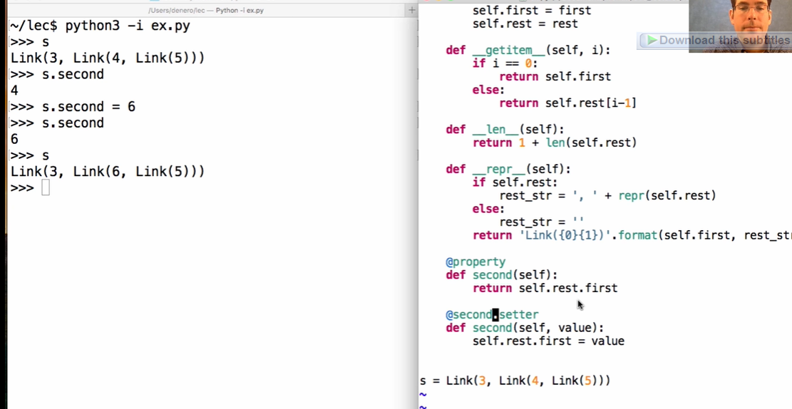
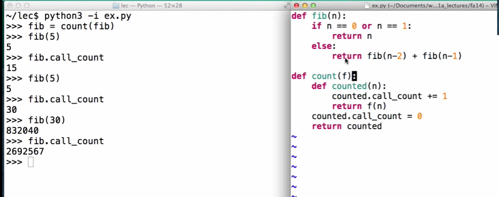
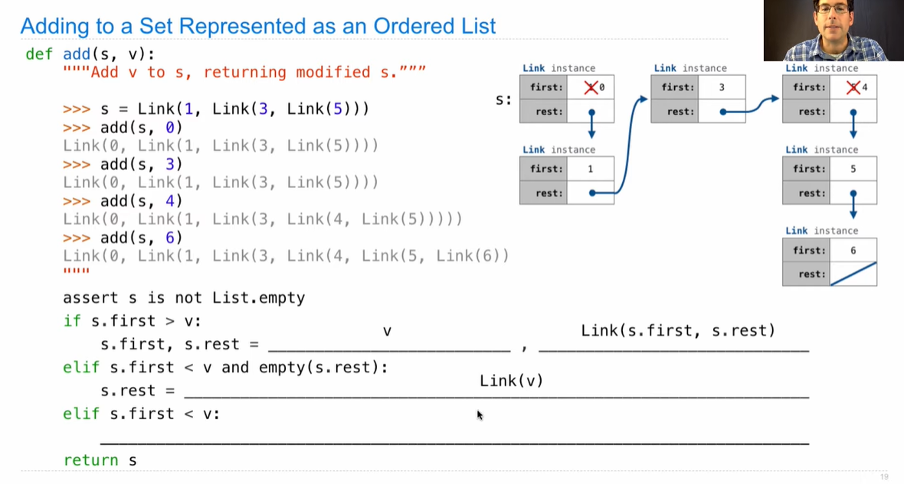

## Linked Lists

```python
class Link:
    empty = ()
    def __init__(self, first, rest=empty):
        assert rest is Link.empty or isinstance(rest, Link)
        self.first = first
        self.rest = rest
```

## Property Methods

```python
>>> s = Link(3, Link(4, Link(5)))
>>> s.second
4
>>> s.second = 6
>>> s.second
6
>>> s
Link(3 Link(6, Link(5)))
```



## Tree Class

```python
class Tree:
    def __init__(self, label, branches=[]):
        self.label = label
        for branch in branches:
            assert isinstance(brance, Tree)
        self.branches = list(branches)
    def __repr__(self):
        if self.branches:
            branch_str = ', ' + repr(self.branches)
		else:
            branch_str = ''
        return 'Tree({0}{1})'.format(repr(self.label), branch_str)
    
    def __str__(self):
        return '\n'.join(self.indented())
    
    def indented(self):
        lines = []
        for b in self.branches:
            for line in b.indented():
                lines.append(' ' + line)
        return [str(self.label)] + lines
    
    def is_leaf(self):
        return not self.branches
    
def fib_tree(n):
    if n == 0 or n == 1:
        return Tree(n)
    else;
    	left = fib_tree(n-2)
        right = fib_tree(n-1)
        fib_n = left.label + right.label
        return Tree(fib_n, [left, right])
```


## Measuring Efficiency



## Memorization

## Exponentiation

```python
def n == 0:
    if n == 0:
        return 1
    else:
        return b * exp(b, n-1)
```

```python
def exp_fast(b, n):
    if n == 0:
        return 1
    elif n % 2 == 0:
        return square(exp_fast(b, n//2))
    else:
        return b * exp_fast(b, n-1)

def square(x):
    return x * x
```


## Mutable Linked lists

```python
class Link:
    empty = ()
    def __init__(self, first, rest=empty):
        assert rest is Link.empty or isinstance(rest, Link)
        self.first = first
        self.rest = rest
   	
    def __getitem__(self, i):
        if i == 0:
            return self.first
        else:
            return self.sest[i-1]
    
    def __len__(self):
        return 1 + len(self.rest)
    
    def __repr__(self):
        if self.rest:
            rest_str = ', ' + repr(self.rest)
        else:
            rest_str = ''
        return 'Link({0})({1})'.format(self.first, rest_str)  
```




 