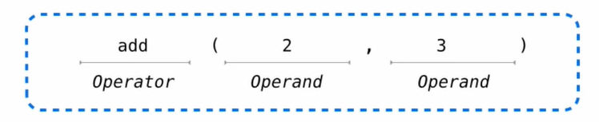
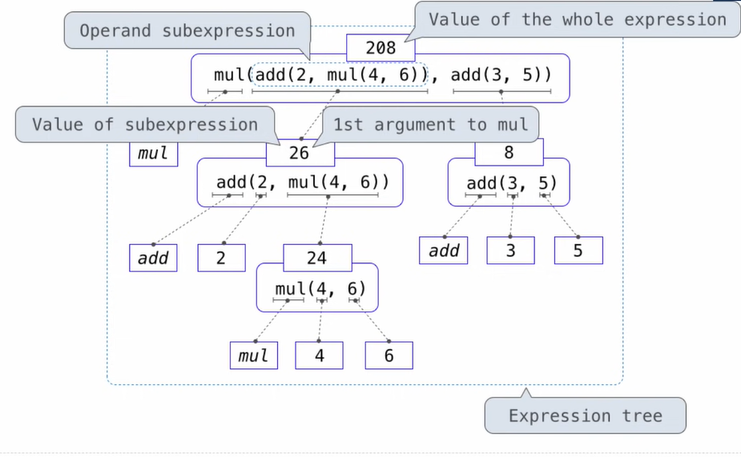

## Expressions

**types of expressions**

An expression describes a computation and evaluates to a value.

```python
>>> 2000 + 5
2015
>>> max(2, 3, 4)
4
>>> min(-2, 5000)
-2
```

```python
>>> from operator import add, mul
>>> add(2, 3)
5
>>> mul(2, 3)
6
```

**Anatomy of a Call Expression**



Operators and operands are also expressions

So they evaluate to values

**Evaluating Nested Expressions**




## Functions, Objects, and Interpreters

```python
>>> shakes = open('shakespare.txt')
>>> text = shakes.read().split()
>>> texr[:25]
...
>>> len(text)
980637
>>> text.count('the')
23272

>>> words = set(text)
>>> 'the' in words
True
>> len(words)
33505
```

```python
>>> 'draw'
'draw'
>>> 'draw'[::-1]
'ward'
>>> {w for w in words if w == w{::-1} and len(w) > 4}
{'minim'}
```