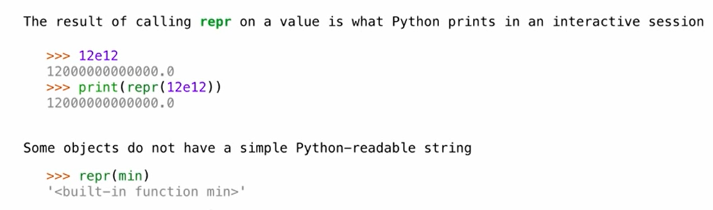
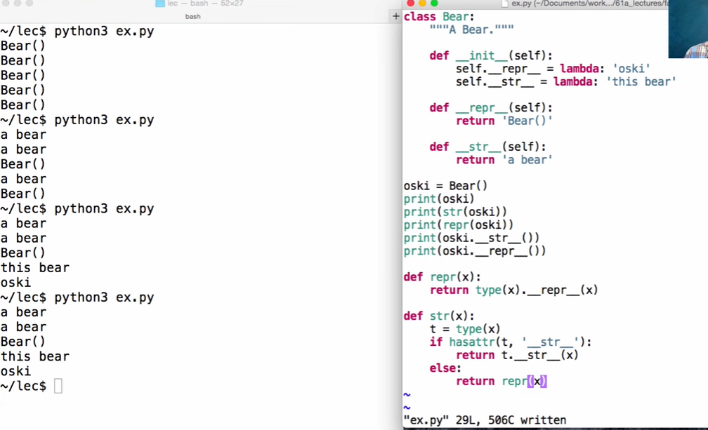
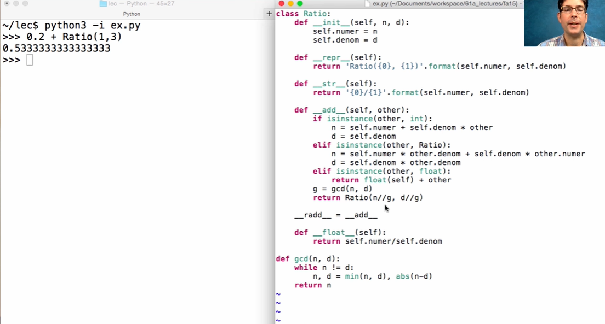

## String Representations

In python, all objects produce two string representations:

- The str is legible to humans
- The repr is legible to the python interpreter

**The repr String for an Object**

The repr function returns a Python expression (a string) that evaluates to an equal object 

repr(object) -> string

Return the canonical string representation of the object.

For most object types, eval(repr(object0 == object))



**The str String for Object**

The result of calling str on the value of an expression is what Python prints using the print funciton:

## Polymorphic Functions

Polymorphic function: A function that applies to many (poly) different forms (morph) of data

str and repr are both polymorphic; they apply to any object

repr invokes a zero-argument method `__repr__` on its argument

str invokes a zero-argument method `__str__` on its argument


**Implementing repr and str**

- An instance attribute called `__repr__` is ignored! Only class attributes are found 
- Questing: How would we implement this behavior?

The behavior of str is also complicated:

- An instance attribute called `__str__` is ignored
- If no `__str__` attribute is found, uses repr string
- Question: How would we implement this behavior?
- str is a class, not a function



**Interfaces**

**Message passing:** Objects interact by looking up attributes on each other (passing messages)

The attribute look-up rules allow different data types to respond to the same message

**A shared message** (attribute name) that elicits similar behavior from different object classes is a powerful method of abstraction


## Special Method Names in Python

```
__init__
__repr__
__add__ Method invoke to add one object to another 
__bool__ Method invoked to convert an object to True of False
__float__ Method invoked to convert an object to a flot(real number)
```

  Adding instances of user-defined classes invokes either the `__add__` or `__radd__` method 




## Modular Design

**Separation of Concerns**

A design principle: Isolate different parts of a program that address different concerns 

A modular component can be developed and tested independently 

 

**Reading Files**

```python 
import json 
for line in open('restaurants.json'):
    r = json.loads(line)
    reviewers = reviewers_for_restaurant[r['business_id']]
    Restaurant(r['name'], r['stars'], reviewers)
```


## Sets

One more built-in Python container type

- set literals are enclosed in braces
- Duplicate elements are removed on construction
- Sets have arbitrary order

```python 
>>> s = {'one', 'two', 'three', 'four', 'four'}
>>> s
{'three', 'one', 'four', 'two'}
>>> 'three' in s
True
>>> s.union({'one', 'five'})
{'three', 'five', 'one', 'four', 'three'}
>>> s.intersection({'six', 'five', 'four', 'three'})
{'three', 'four'}
```

