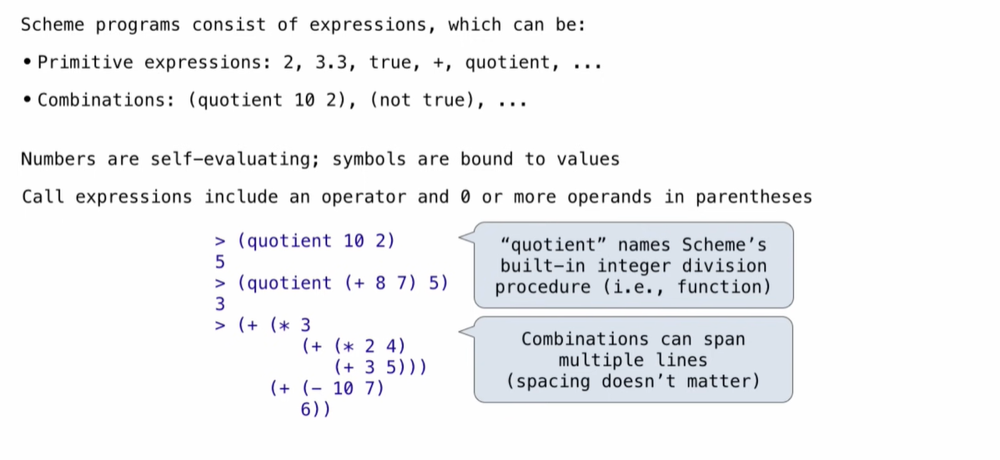
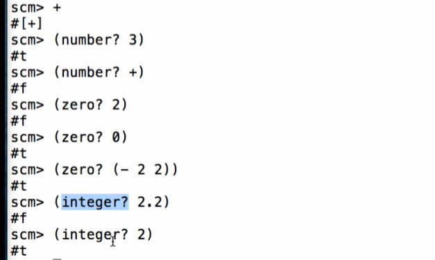
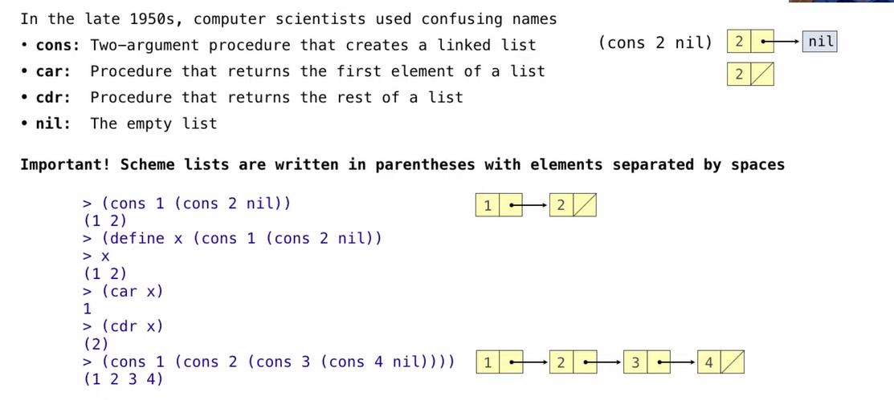

## Scheme

Scheme is a Dialect of Lisp

**Scheme Fundamentals**



```scheme
scm> 2
2
scm> (+ 1 2 3 4)
10
scm> (+)
0
scm> (* 1 2 3 4)
24
scm> (*)
1
```



## Special Forms

```
(if <predicate> <consequent> <alternative>)

(and <e1> ... <en>), (or <e1> ... <en>)

(define <symbol> <experssion>)

(define (<symbol> <formal parameters>) <body>)
```

```scheme
(define (sqrt x)
  	(define (update guess)
 		(if (= (square guess) x)
            guess
            (update (average guess (/x guess)))))
  	(update 1))
```

## Scheme Interpreters

## Lambda Expressions

```scheme
(lambda (<formal-parameters>) <body>)

(define (plu4 x) (+  4))
(define plus4 (lambda (x) (+ x 4)))
```

## Lists



 ```scheme
 (draw (cons 1, 2))
 (list? s)
 (null? nil) 
 (list 1 2 3 4)
 ```


## Symbolic Programming

 ```scheme
 > (list a b)
 (1 2)
 ```

No sign of "a" and "b" in the resulting value

Quotation is used to refer to symbols directly in Lisp

```scheme
> (list 'a 'b)
(a b)
> (list 'a b)
(a 2)
```

Short for (quote a), (quote b):

Special form to indicate that the expression itself is the value.

Quotation can also be applied to combinations to form lists

```scheme
> '(a b c)
(a b c)
```

```scheme
> `(a b c)
(a b c)

> `(a ,b c)
(a 2 c)

> '(a ,b c)
(a (unquote b) c)
```


```scheme
(define (line) (fd 50))
(define (twice fn) (fn) (fn))
(define (repeat k fn)
    (fn)
    (if (> k 1) (repeat (- k 1) fn)))
(define (tri fn)
    (repeat 3 (lambda () (fn) (lt 120))))
(define (sier d k)
    (tri (lambda () (if (= d 1) (fd k) (leg d k)))))
(define (leg d k)
    (sier (- d 1) (/ k 2))
    (penup) (fd k) (pen down))
```

