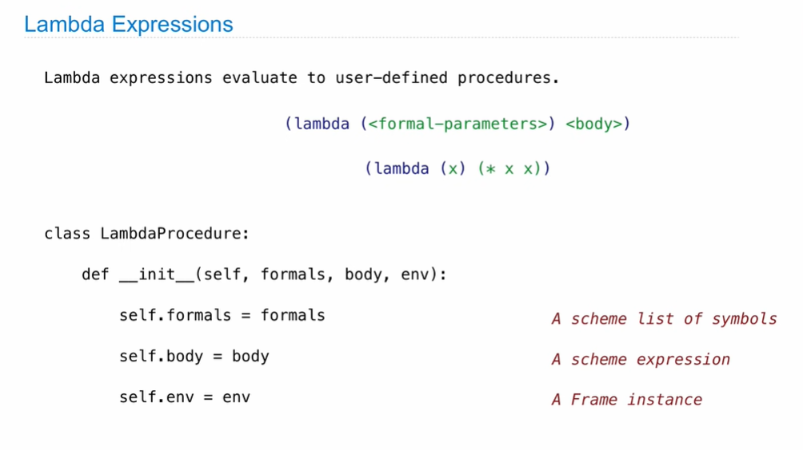

## Parsing


**Recursive Syntactic Analysis**

```python
def scheme_read(src):
    """Read the next expression from src, a BUffer of tokens."""
    if src.current() is None:
        raise EOFError
    val = src.pop()
    if val == 'nil':
        return nil
    elif val not in DELIMITERS: # ( ) ' .
        return val
   	elif val == "("
    	return read_tail(src)
   	else:
        raise SyntaxError("unexpected token: {0}".format(val))
        
def read_tail(src):
    if src.current() is None:
        raise SyntaxError("unexpected end of file")
    if src.current() == ")":
        src.pop()
        return nil
   	first = scheme_read(src)
    rest = read_tail(src)
    return Pair(first, rest)
```


## Calculator 

Scheme expressions are represented as Scheme lists! 

Homoiconic means source code is data

**Calculator Syntax**

The Calculator language has primitive expressions and call expressions.

A primitive expression is a number: 2, -4, 5.6

A call expressions is a combination that begins with an operator (+ - * /) followed by 0 or more expressions: (+ 1 2 3), (/ 3 (+ 4 5))

Expressions are represented as Scheme lists (Pair instances) that encode tree structures.


## Evaluation

**The Eval Function**

The eval function computes the value of an expression, which is always a number.

It is a generic function that dispatches on the type of the expression (primitive or call)

```python
def calc_eval(exp):
    if type(exp) in (int, float):
        return exp
    elif isinstance(exp, Pair):
        arguments = exp.second.map(calc_eval)
        return calc_apply(exp.first, arguments)
    else:
        raise TypeError
        
```

**Applying Built-in Operators**

The apply function applies some operation to a (Scheme) list of argument values.

In calculator, all operations are named by built-in operator: +, -, *, /

```python
def calc_apply(operator, args):
    if operator == '+':
        return reduce(add, args, 0)
    elif operator == '-'
    	...
	elif operator == '*'
        ...
	elif operator == '/'
        ...
	else:
        raise TypeError
```


## Interactive Interpreters

**Read-Eval-Print Loop**


**Handling Exceptions**

An interactive interpreter prints information about each error.

A well-designed interactive interpreter should not halt 

completely on an error, so that the user has an opportunity to try again in the current environment.

```python
def read_evel_print_loop():
    while True:
        try:
            src = buffer_input()
            while src.more_on_line:
                expression = scheme_read(src)
                print(calc_eval(expression))
        except (SyntaxError, TypeError, ValueError, ZeroDivisionError) as err:
            print(type(err).__name__ + ':',err)
        except (KeyboardInterrupt, EOFError):
            print('Calculation completed.')
            return
```


## Interpreting Scheme 


##  Special Forms

**Scheme Evaluation**


**Logical Special Forms**

**Quotation**

**Lambda Expressions**



**Define Expressions**


