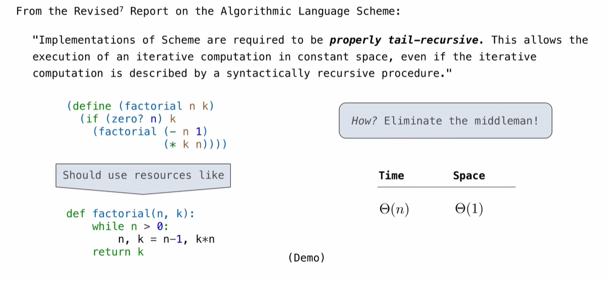
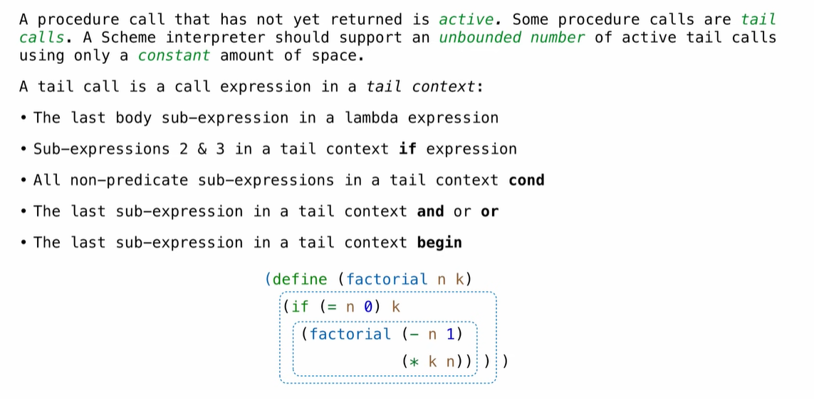

## Dynamic Scope 

The way in which names are looked up in Scheme and Python is called lexical scope (or static scope)

**Lexical scope:** The parent of a frame is the environment in which a procedure was defined.

**Dynamic scope:** The parent of a frame is the environment in which a procedure was called.

```scheme
(define f (lambda (x) (+ x y)))
(define g (lambda (x y) (f (+ x x))))
(g 3 7)
```

**Lexical scope: **The parent for f's frame is the global frame.

**Dynamic scope:** The parent for f's frame is g's frame.


## Tail Recursion

**Functional Programming**

All functions are pure functions.

No re-assignment and no mutable data types.

Name-value bindings are permanent.

**Tail Recursion**




## Tail Calls

 

**Eval with Tail Call Optimization**


## General Computing Machines

 

**Interpreters are General Computing Machine**

Our Scheme interpreter is a universal machine

A bridge between the data objects that are manipulated by our programming language and the programming language itself

Internally, it is just a set of evaluation rules