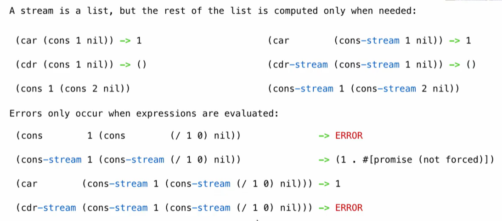
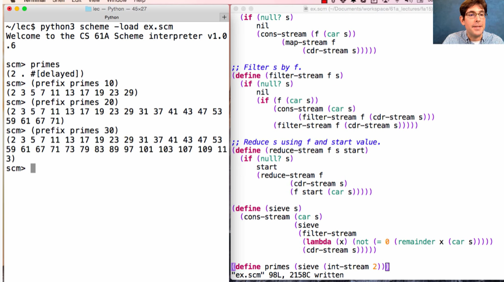

## Streams

**Streams are Lazy Scheme Lists** 



```scheme
(define (range-stream a b)
  (if (>= a b)
      nil
      (cons-stream a (range-stream (+ a 1） b)))))
(define  lots (range-stream 1 100000000000000))
```


**Integer Stream**

```scheme
(define (int-stream) start)
	(cons-stream start (int-stream (+ 1 start))))
    
(define (prefix s k)
  (if (= k 0)
      ()
      (cons (car s) (prefix (cdr-stream s) *- k 1)))))
```


**Stream Processing**

```scheme
(define (square-stream s)
  (cons-stream (* (car s) (car s))
               (square-stream (cdr-stream s)))) 
```

```scheme
(define (add-streams s t)
  (cons-stream (+ (car s) (car t))
               (add-streams (cdr-stream s)
                            (cdr-stream t))))
```


**Higher-Order Functions on Streams**

