## Declarative Languages

**Database Management Systems**

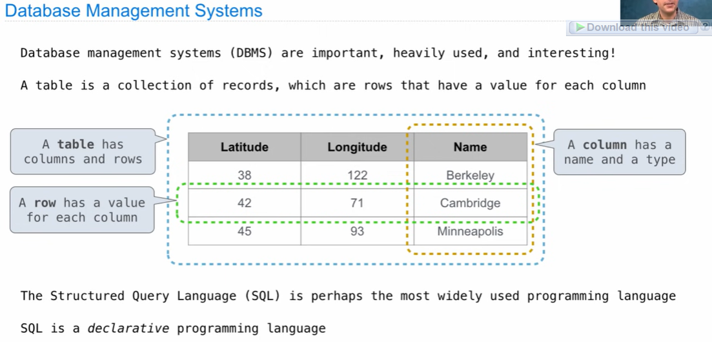

**Declarative Programming**

In **declarative languages** such as SQL & Prolog:

- A "program" is a description of the desired result 
- The interpreter figures out how to generate the result

In **imperative languages** such as python & scheme:

- A "program" is a description of computational processes
- The interpreter carries out execution/evaluation rules

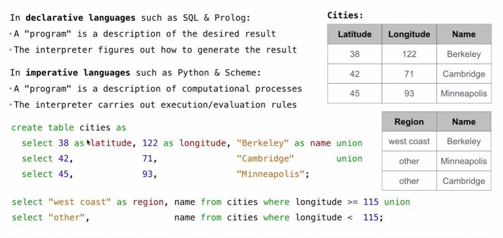


## Structured Query Language (SQL)

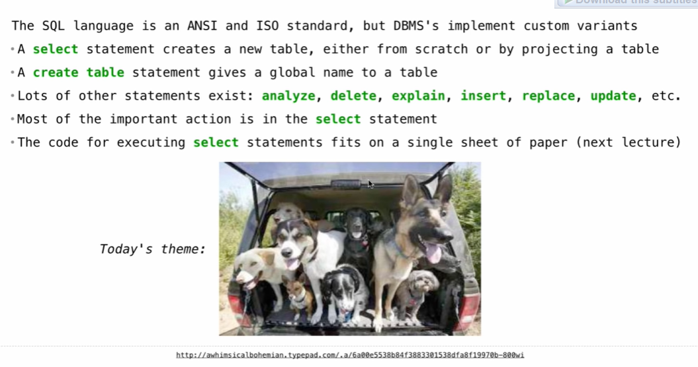

**Selecting Value Literals**

```sql
select [expression] as [name], [expression] as [name];
```

All SQL statements end in a semicolon

The union of two select statements is a table containing the rows of both of both of their results

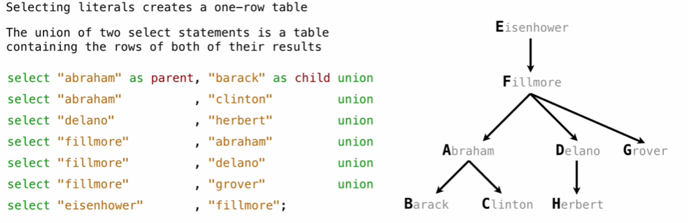

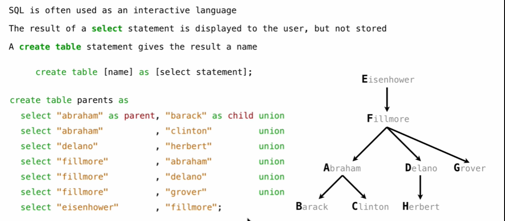

## Projecting Tables

**Select Statements Project Existing Tables**

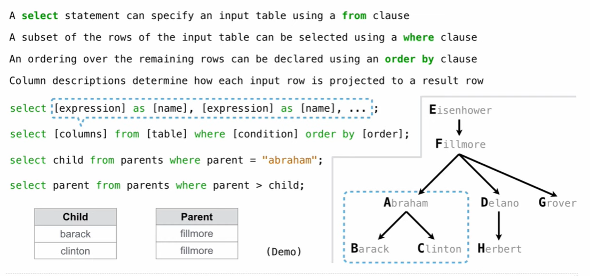

## Arithmetic

**Arithmetic in Select Expressions**

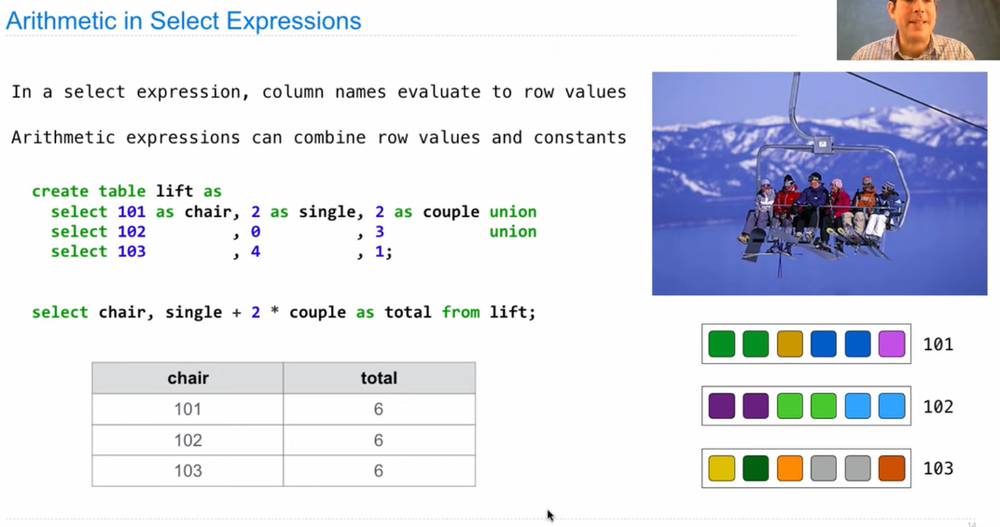

## Joining Tables

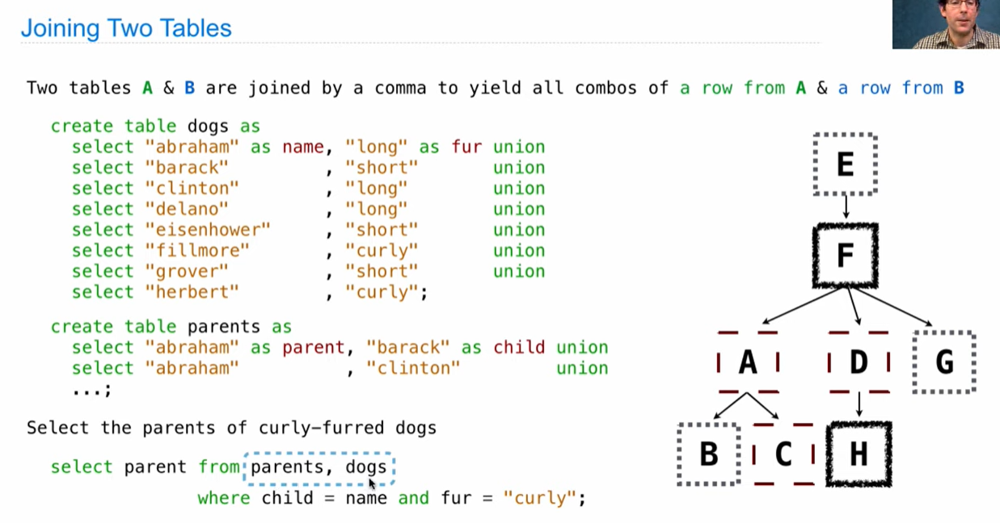


## Aliases and Dot Expressions

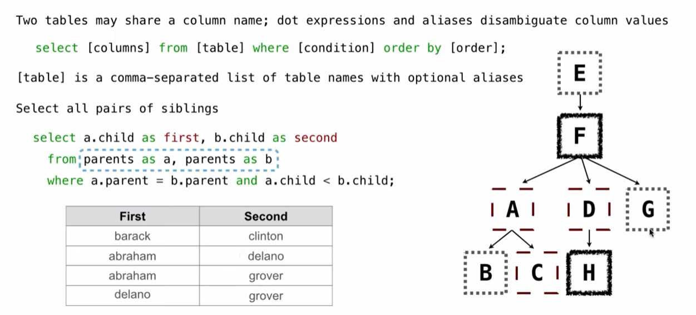


## Numerical Expressions

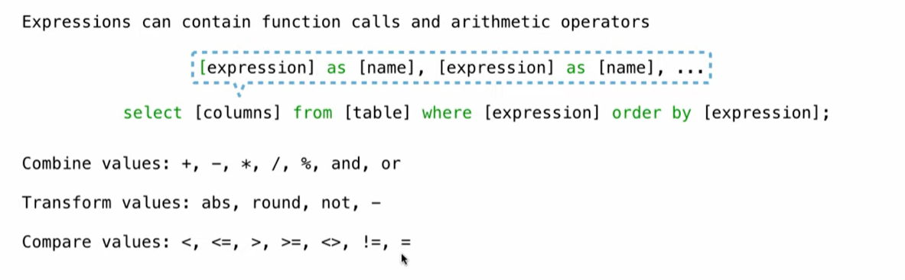

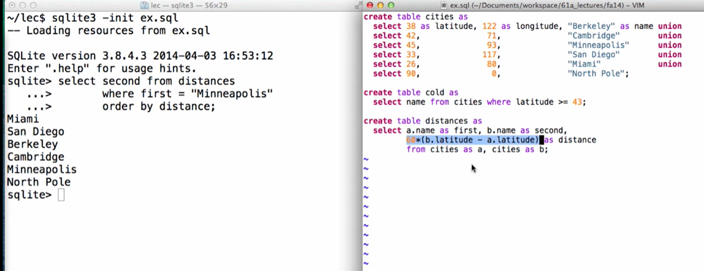


## String Expressions

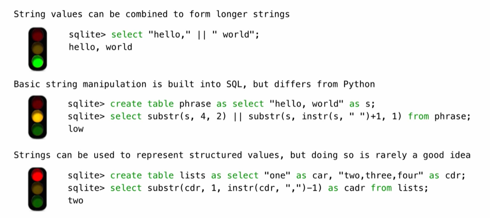

