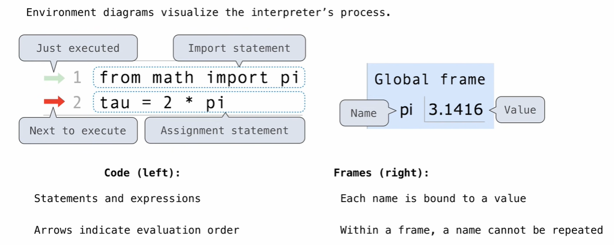
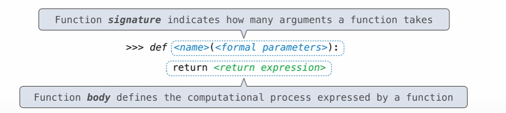
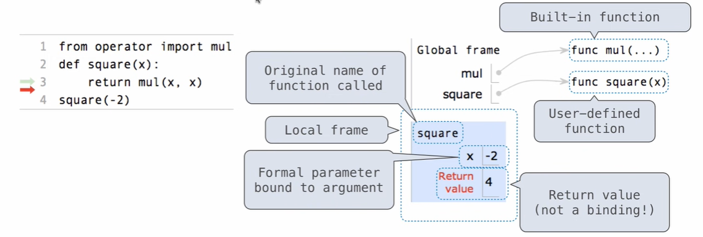

## Names, Assignment, and User-Defined Functions

Import build-in variables

```python
from math import pi
```

Define names using an assignment statement.

```python
radius = 10
area, circ = pi * radius * radius, 2 * pi * radius
```

Assignment statements can also be used to give names to functions.

```python
>>> f = max
>>> f
<built-in function max>
>>> f(1, 2, 3) 
3

>>> max = 7
>>> max
7
```

Def statement

```python
def square(x):
    return mul(x, x)
```


## Environment Diagrams

Environment diagrams are a way for us to keep track of what's going on within the Python interpreter when it executes a program that we typed.



website: https://pythontutor.com/live.html#mode=edit


## Defining Functions

Assignment is a simple means of abstraction: binds names to values

Function definition is a more powerful means of abstraction: binds names to expressions



**Calling User-Defined Functions**

1. Add a local frame, forming a new environment
2. Bind the function's formal parameters to its arguments in that frame
3. Execute the body of the function in that new environment



**Looking Up Names In Environments**

Most important two things I'll say all day:

- An environment is a sequence of frames.

- A name evaluates to the value bound to that name in the earliest frame of the current environment in which that name is found.