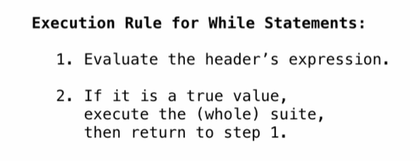

## Print and None

The special value `None` represents nothing in python.

A function that does not explicitly return a value will return `None`

**Pure Functions**: just return values

**Non-Pure Functions**: have side effects


## Miscellaneous Python Features

**doctest**

```python
from operator import floordiv, mod

def divide_exact(n, d):
    """Return the quotient and remainder of dividing N by D.
    
    >> q, r = divide_exact(2013, 10)
    >> q
    201
    >> r
    3
    """
    return floordiv(n, d), mod(n, d)
```

**default argument**

```python
def divide_exact(n, d=10):
```


## Conditional Statement

A `statement` is executed by the interpreter to perform an action.


**Conditional Statements**


**Boolean Contexts**

False values in Python: False, 0, '', None (more to come)

True values in Python: Anything else (True)


## Iteration 

**While Statements**




## Return

**Return Statement**

A return statement completes the evaluation of a call expression and provides its value.

```python
def search(f):
    x = 0
    while True:
        if f(x):
            return x
       	x += 1
def inverse(f):
    """Return g(y) such that g(f(x)) -> x"""
    return lambda y: search(lambda x: f(x) == y)
```


## Designing Functions

**A Guide to Designing Function**

- Give each function exactly one job.
- Don't repeat yourself (DRY). Implement a process just once, but execute it many times.
- Define functions generally.


## Control

**If Statements and Call Expression**


## Control Expressions

**Logical Operators**

`<left> and <right>`

1. Evaluate the subexpression `<left>`
2. If the result is a false value v, then the expression evaluates to v.
3. Otherwise, the expression evaluates to the value of the subexpression `<right>`

`<left> or <right>`

1. Evaluate the subexpression `<left>`
2. If the result is a true value v, then the expression evaluates to v.
3. Otherwise, the expression evaluates to the value of the subexpression `<right>`


**Conditional Expressions**

`<consequent> if <predicate> else <alternative>`

1. Evaluate the subexpression `<predicate>`
2. If the result is a true value, the value of the whole expression is the value of the `<consequent>`
3. Otherwise, the value of the whole expression is the value of the `<alternative>`

