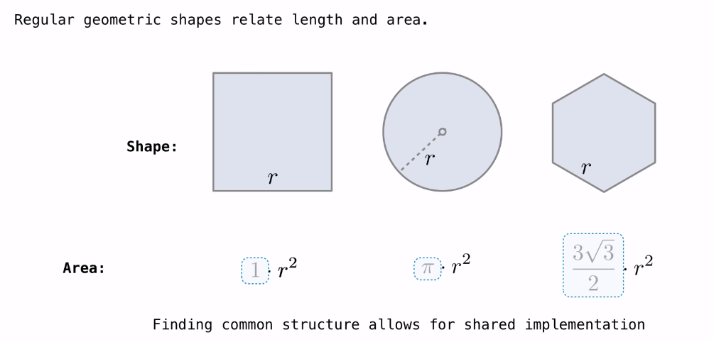
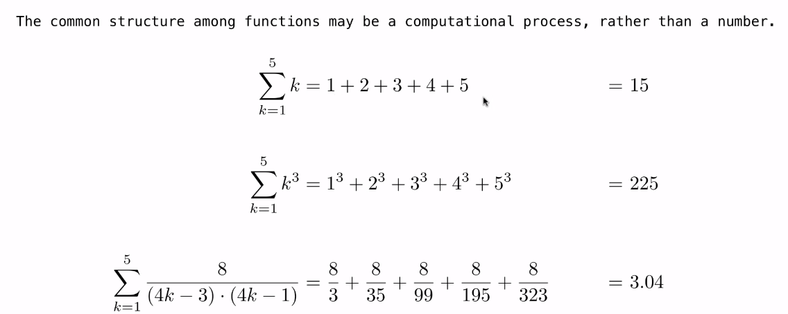
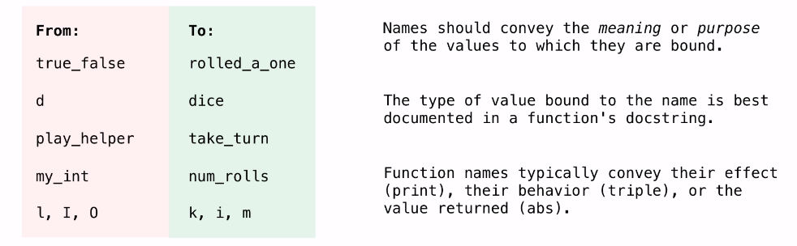
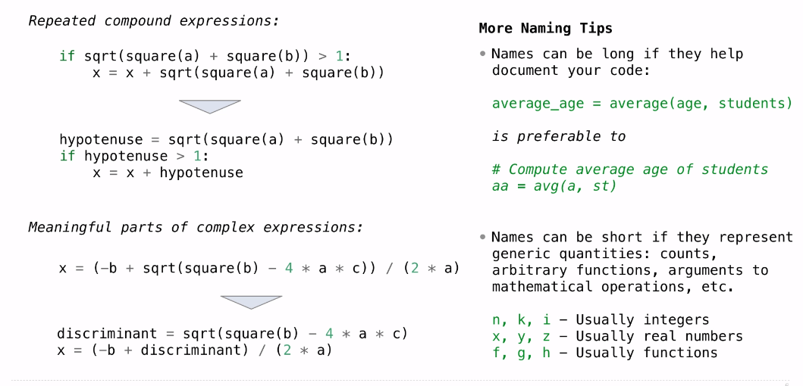

## Higher-Order Functions

**Generalizing Patterns with Arguments**



```python
from math import pi, sqit

def area_square(r):
    assert r > 0, 'A length must be positive'
    return r * r

def area_circle(r):
    return r * r * pi

def area_hexagon(r):
    return r * r * r * sqrt(3) / 2
```

**Generalization.**

```python
from math import pi, sqit

def area(r, shape_constant):
    assert r > 0, 'A length must be positive'
    return r * r * shape_constant

def area_square(r):
    return area(r, 1)

def area_circle(r):
    return area(r, pi)

def area_hexagon(r):
    return area(r, 3 * sqrt(3) / 2)
```


**Generalizing Over Computational Processes**



```python
def sum_naturals(n):
    """Sum the first N natural number
    
    >> sum_naturals(5)
    15
    """
    total, k = 0, 1
    while k <= n:
        total, k = total + k, k + 1
    return total

def sum_cubes(n):
    """Sum the first N cubes of natural numbers.
    
    >>> sum_cubes(5)
    225
    """
    total, k = 0, 1
    while k <= n:
        total, k = total + pow(k, 3), k + 1
    return total
```

**generalization**

```python
def identity(k):
    return k

def cube(k):
    return pow(k, 3)

# This is a higher-order function
def summation(n, term):
    """Sum the first N terms of a sequence.
    
    >>> summation(5, cube)
    225
    """
    total, k = 0, 1
    while k <= n:
        total, k = total + term(k), k + 1
    return total
    
def sum_naturals(n):
    """Sum the first N natural number
    
    >> sum_naturals(5)
    15
    """
    return summation(n, identity)

def sum_cubes(n):
    """Sum the first N cubes of natural numbers.
    
    >>> sum_cubes(5)
    225
    """
   return summation(n, cube)
```


```python
def make_adder(n):
    """Return a function that takes one argument
    K and return K + N.
    
    >>> add_three = make_adder(3)
    >>> add_three(4)
    7   
    """
    def adder(k):
        return k + n
    return adder
```

**The purpose of Higher-Order Functions**

**Functions are first-class:** Functions can be manipulated as values in our programming language.

**Higher-order function: ** A function that takes a function as an argument value or returns a function as a return value


Higher-order functions:

- Express general methods of computation
- Remove repetition from programs
- Separate concerns among functions


**Example**

```python
from wave import open
from struct import Struct
from math import floor

frame_rate = 11025

def encode(x):
    """Encode float x between -1 and 1 as two bytes.
    """
    i = int(16384 * x)
    return Struct('h').pack(i)

def play(sampler, name="song.wav", seconds=2):
    """Write the output of a sampler function as a wav file.
    """
    out = open(name, 'wb')
    out.setnchannels(1)
    out.setsampwidth(2)
    out.setframerate(frame_rate)
    t = 0
    while t < seconds * frame_rate:
        sample = sampler(t)
        out.writeframes(encode(sample))
        t = t + 1
    out.close()

def tri (frequency, amplitude=0.3):
    """A continuous trigangle wave."""
    period = frame_rate // frequency
    def sampler(t):
        saw_wave = t / period - floor(t / period + 0.5)
        tri_wave = 2 * abs(2 * saw_wave) - 1
        return amplitude * tri_wave
    return sampler

c_freq, e_freq, g_freq = 261.63, 329.63, 392.00


def both(f, g):
    return lambda t: f(t) + g(t)

def note(f, start, end, fade=0.01):
    def sampler(t):
        seconds = t / frame_rate
        if seconds < start:
            return 0
        elif seconds > end:
            return 0
        elif seconds < start + fade:
            return (seconds - start) / fade * f(t)
        elif seconds > end - fade:
            return (end - seconds) / fade * f(t)
        else:
            return f(t)
    return sampler

def mario_at(octave):
    c, e = tri(octave * c_freq), tri(octave * e_freq)
    g, low_g = tri(octave * g_freq), tri(octave * g_freq / 2)
    return mario(c, e, g, low_g)

def mario(c, e, g, low_g):
    z = 0
    song = note(e, z, z + 1/8)
    z += 1/8
    song = both(song, note(e, z, z + 1/8))
    z += 1/4
    song = both(song, note(e, z, z + 1/8))
    z += 1/4
    song = both(song, note(c, z, z + 1/8))
    z += 1/8
    song = both(song, note(e, z, z + 1/8))
    z += 1/4
    song = both(song, note(g, z, z + 1/4))
    z += 1/2
    song = both(song, note(low_g, z, z + 1/4))
    z += 1/2
    return song

play(mario_at(1.5))
```


**Function Composition**

```python
def make_adder(n):
    def adder(k):
        return k + n
   	return adder

def square(x):
    return x * x

def triple(x):
    return 3 * x

def compose1(f, g):
    def h(x):
        return f(g(x))
    return h
```


**Function Currying**

```python
def curry2(f):
    def g(x):
        def h(y):
            return f(x, y)
        return h
    return g
```

```python
>>> make_adder = curry2(add)
>>> add_three = m(3)
>>> add_three(2)
5
>>> curry2 = lambda f: lambda x: lambda y: f(x, y)
>>> m = curry2(add)
>>> m(2)(3)
5
```


**Function Abstractions**

Choosing Names



Which Values Deserve a Name



