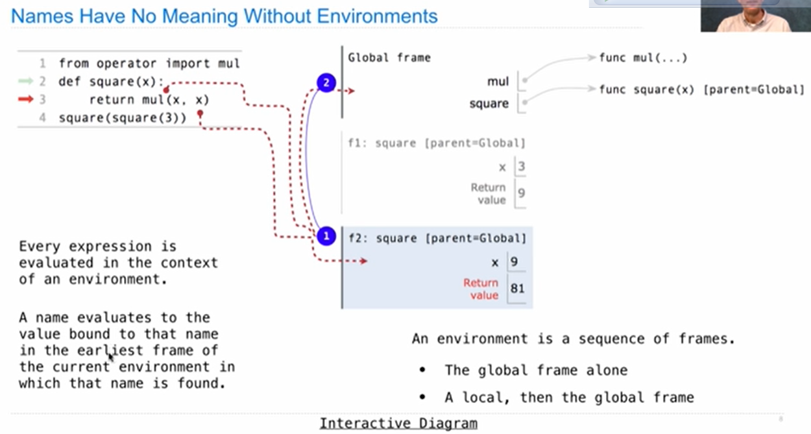

## Multiple Environments



 

A name evaluates to the value bound to that name in the earliest frame of the current environment in which that name is found. 


## Environment for Higher-Order Functions

 Example

```python
def repeat(f, x):
    while f(x) != x:
        x = f(x)
    return x

def g(y):
    return (y + 5) // 3

result = repeat(g, 5)
```

  

## Environments for Nested Definitions

```python
def make_adder(n):
    def adder(k):
        return k + n
    return adder

add_three = make_adder(3)
add_three(4)
```


- Every user-defined function has a parent frame (often global)
- The parent of a function is the frame in which it was defined
- Every local frame has a parent frame (often global)
- The parent of a frame is the parent of the function called

## Local Names


## Lambda Expressions

```python
square = lambda x: x * x
```

Must be a single expression


**Difference**

- Only the def statement gives the function an intrinsic name.


## Self-Reference

```python
def print_all(x):
    print(x)
    return print_all

print_all(1)(3)(5)
```

```python
def print_sums(x):
    print(x)
    def next_sum(y):
        return print_sums(x+y)
    return next_sum

print_sums(1)(3)(5)
```

https://pythontutor.com/visualize.html#mode=edit

 


## Decorators

```python
from ucb import trace

def trace1(fn):
    def traced(x):
        print('Calling', fn, 'on argument', x)
        return fn(x)
    return traced

@trace1
def square(x):
    return x * x
# equal to 'square = trace1(squre)'

def sum_squares_up_tp(n):
    k = 1
    total = 0
    while k <= n:
        total, k = total + square(k), k + 1
        return total
```