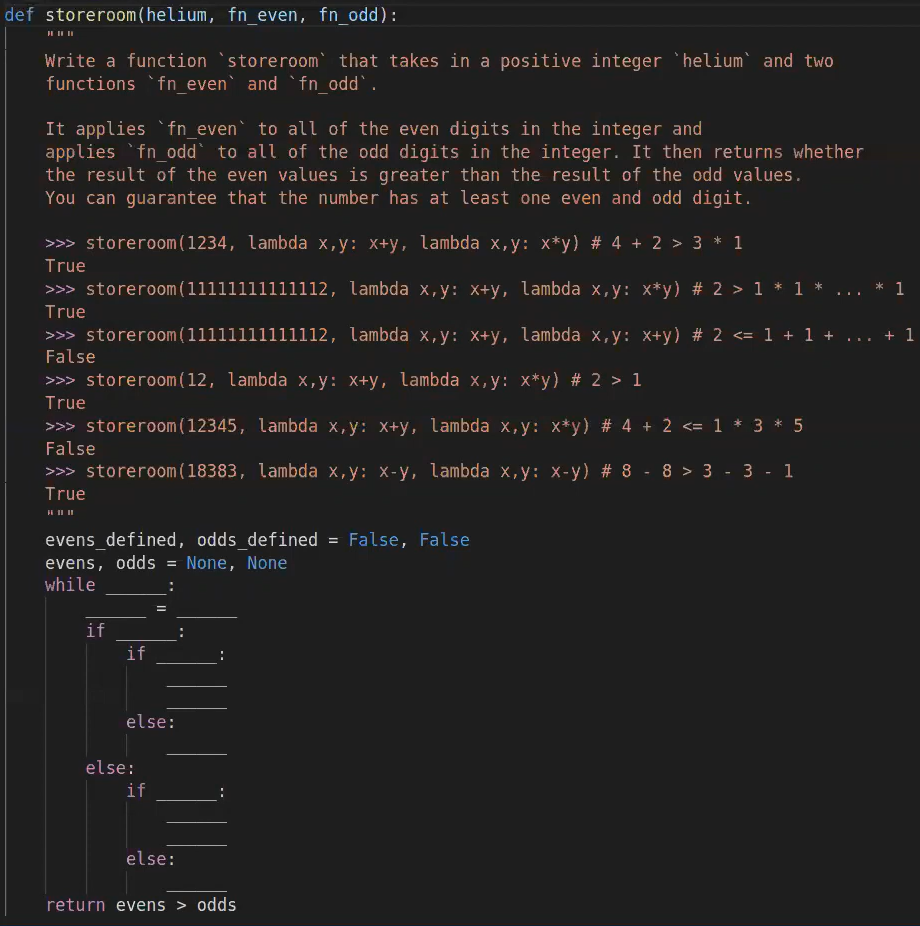

## Key Value Store


```python
def lens(prev=lambda x: 0):
    def put(k, v):
        def get(k2):
            if k == k2:
                return v
            else:
                return prev(k2)
        return get, lens(get)
    return put
```

## Storeroom



```python
def storeroom(helium, fn_even, fn_odd):
    evens_defined, odds_defined = False, False
    evens, odds = None, None
    while helium:
        helium, last = helium // 10, helium % 10
        if last % 2:
            if odds_defined == False:
                odds_defined = True
                odds = last
            else:
                odds = fn_odd(odds, last)
        else:
            if evens_defined == False:
                evens_defined = True
                evens = last
            else:
                evens = fn_odd(evens, last)
    return evens > odds
```

## Maximum subnumber


```python
def sculptural(ruler, k):
    if ruler == 0 or k == 0:
        return 0
    a = sculptural(ruler//10, k-1) * 10 + ruler%10
    b = sculptural(ruler//10, k)
    return max(a, b)
```

