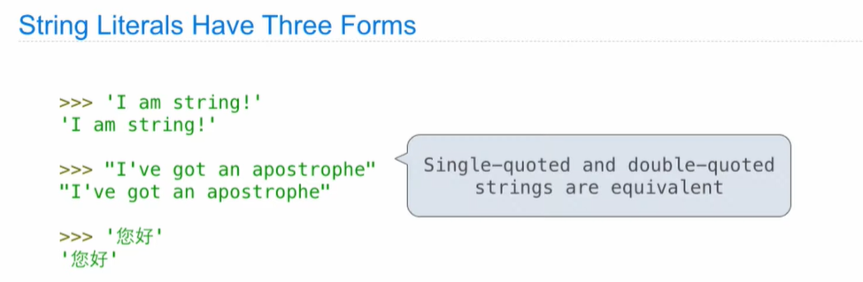
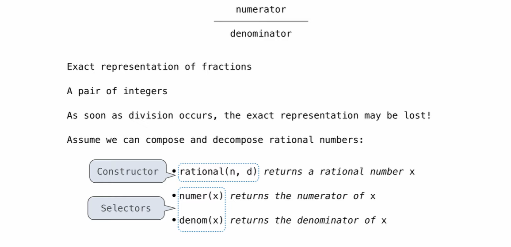
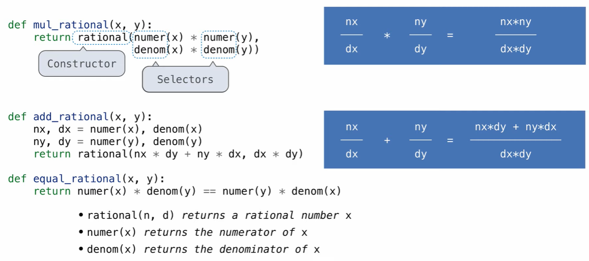
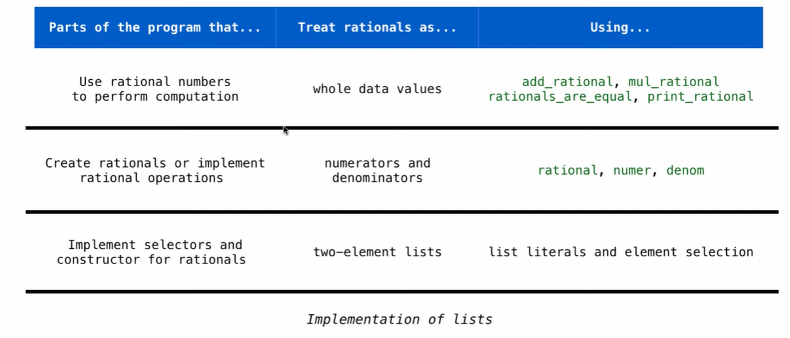
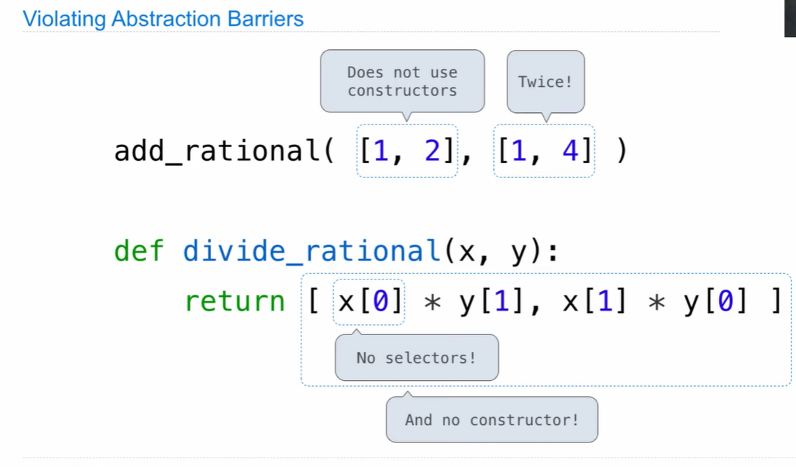
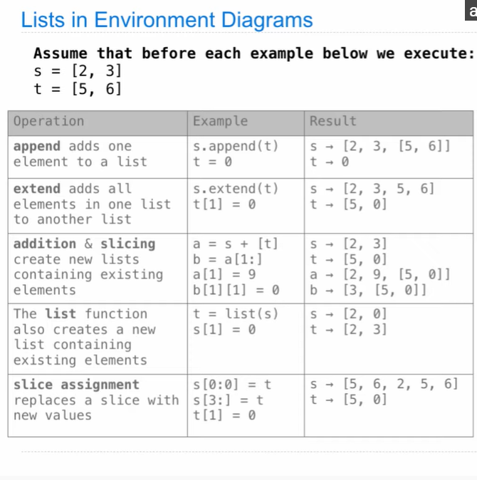
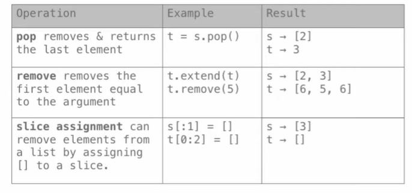
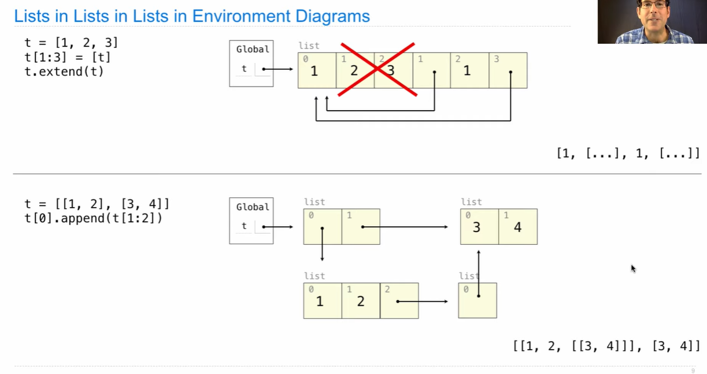

## List

Lists are a built-in data type in Python

```python
>> odds = [41, 43, 47, 49]
odds = [41, 43, 47, 49]
>> odds[0]
41
>> len(odds)
4
```

**Working with Lists**

```python
>> digits = [1, 8, 2, 8]
>> getitem(digits, 3) 
8

# Concatenation and repetition
>> [2, 7] + digits * 2
[2, 7, 1, 8, 2, 8, 1, 8, 2, 8]
>> add([2, 7], mul(digit, 2))
[2, 7, 1, 8, 2, 8, 1, 8, 2, 8]

# Nested lists
>> pairs = [[10, 20], [30, 40]]
```


## Containers

Built-in operators for testing whether an element appears in a compound value

```python
>> digits = [1, 8, 2, 8]
>> 1 in digits
True
>> 5 not in digits
True
```

## For Statements

```python
def count(s, value):
    total, index = 0, 0
    while index < len(s):
        element = s[index]
        
        if element == value:
            total += 1
            
        index += 1
     return total
	
# ==================================
	total = 0
    for element in s:
        if element == value:
            total += 1
    return total
```

**For Statement Execution Procedure**

for [name] in [expression]:

​	[suite]

1. Evaluate the header [expression], which must yield an iterable value (a sequence)
2. For each element in that sequence, inder:
   1. Bind [name] to that element in the current frame
   2. Execute the [suite]

**Sequence Unpacking in For Statements**

```python
for x, y in pairs:
    if x == y:
        same_count += 1
```


## Range

A range is a sequence of consecutive integers

range(-2, 2)

- Length: ending value - starting value
- Element selection: starting value + index

convert to list

```python
>> list(range(-2, 2))
[-2, -1, 0, 1]
```


Note:

```python
>> range(4)
range(0, 4)
```

```python
def sum_below(n):
    total = 0
    for i in range(n):
        total += i
    return total

def cheer():
    for _ in range(3):
        print('Go Bears!')
```


## List Comprehensions

Takes an existing list and computes a new list from it.

```python
>>> [letters[i] for i in [3, 4, 6, 8]]
>>> [x+1 for x in odds]
>>> [x for x in odds if 25 % x == 0 ]
```

```python
def divisors(n):
    return [1] + [x for x in range(2, n) if n%x==0]

```

**Higher-Order Functions.** The common patterns we have observed in sequence processing can be expressed using higher-order functions. First, evaluating an expression for each element in a sequence can be expressed by applying a function to each element.

```python
>>> def apply_to_all(map_fn, s):
        return [map_fn(x) for x in s]
```


## Strings

Strings are an Abstraction

```python
>>> 'curry = lambda f: lambda x: lambdas y: f(x, y)'
>>> exec('curry = lambda f: lambda x: lambdas y: f(x, y)')
>>> curry
<function>
```

String Literals Have Three Forms

```python
>>> 'I am string!'
>>> "I've got an apostrophe"
>>> '您好'
>>> """ aaaaa
bbbbbb
cccccc"""
'aaaa\nbbbbbb\ncccccc'
# A triple-quoted string can span multiple lines
```



惊现汉语（


**Strings are Sequences**

Length and element selection are similar to all sequences

```python
>>> city = 'Berkeley'
>>> len(city)
8
>>> city[3]
```

However, the "in" and "not in" operators match substrings

```python
>>> 'here' in "Where's Waldo?"
True
```


## Data Abstraction

Rational Number






## Pairs

Representing Pairs Using Pairs 

```python
pair = [1, 2]

x, y = pair
```


```python
def rational(n, d):
    return [n, d]
def numer(x):
    return x[0]
def denom(x):
    return x[1]
```


**Reducing to Lowest Terms**

```python
from fractions import gcd

def rational(n, d):
    g = gcd(n, d)
    return [n//g, d//g]
```


## Abstraction Barriers 





In general, the underlying idea of data abstraction is to identify a basic set of operations in terms of which all manipulations of values of some kind will be expressed, and then to use only those operations in manipulating the data. By restricting the use of operations in this way, it is much easier to change the representation of abstract data without changing the behavior of a program.


## Dictionaries

```python
>>> numerals = {'I': d, 'V': 5, 'X': 10}
{'I': d, 'V': 5, 'X': 10}
>>> numerals['X']
>>> numerals.keys()
dict_keys(['X', 'V', 'I'])
>>> numerals.values()
dict_values([10, 5, 1])
>>> numerals.items()
dict_items([('X', 10), ('V', 5), ('I', 1)])


>>> 'X' in numerals
True
>>> numerals.get('X', 0)
# if 'X' do not exist, it will return 'X' 
10
```

dictionary comprehension

```python
>>> {x:x*x for x in range(10)}
```

you can't have a key twice

```python
>>> {1: 2, 1: 3}
{1: 3}
```


**Limitations on Dictionaries**

Dictionaries have **unordered** collections of key-value pairs

Dictionary keys do have two restrictions:

- A key of a dictionary **cannot be** a list or a dictionary (or any mutable type)
- Two **keys cannot be equal;** There can be at most one value for a given key


## Examples: lists





 



extend, slice is not reference

