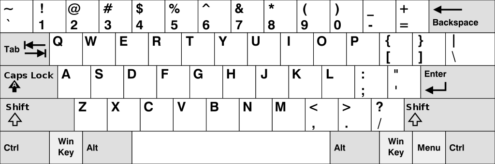

# Phase 1: Typing

### Problem 1 (1 pt)

Implement `choose`, which selects which paragraph the user will type. It takes a list of `paragraphs` (strings), a `select` function that returns `True` for paragraphs that can be selected, and a non-negative index `k`. The `choose` function return's the `k`th paragraph for which `select` returns `True`. If no such paragraph exists (because `k` is too large), then `choose` returns the empty string.

Before writing any code, unlock the tests to verify your understanding of the question.

```python
def choose(paragraphs, select, k):
    """Return the Kth paragraph from PARAGRAPHS for which SELECT called on the
    paragraph returns true. If there are fewer than K such paragraphs, return
    the empty string.
    """
    # BEGIN PROBLEM 1
    "*** YOUR CODE HERE ***"
    for word in paragraphs:
        if select(word):
            if k == 0:
                return word
            else:
                k -= 1
    return ''
```

### Problem 2 (2 pt)

Implement `about`, which takes a list of `topic` words. It returns a function which takes a paragraph and returns a boolean indicating whether that paragraph contains any of the words in `topic`. The returned function can be passed to `choose` as the `select` argument.

To make this comparison accurately, you will need to ignore case (that is, assume that uppercase and lowercase letters don't change what word it is) and punctuation.

Assume that all words in the `topic` list are already lowercased and do not contain punctuation.

> **Hint**: You may use the string utility functions in `utils.py`.

```python
def about(topic):
    """Return a select function that returns whether a paragraph contains one
    of the words in TOPIC.

    >>> about_dogs = about(['dog', 'dogs', 'pup', 'puppy'])
    >>> choose(['Cute Dog!', 'That is a cat.', 'Nice pup!'], about_dogs, 0)
    'Cute Dog!'
    >>> choose(['Cute Dog!', 'That is a cat.', 'Nice pup.'], about_dogs, 1)
    'Nice pup.'
    """
    assert all([lower(x) == x for x in topic]), 'topics should be lowercase.'
    # BEGIN PROBLEM 2
    "*** YOUR CODE HERE ***"
    def select(paragraph):
        words = split(lower(remove_punctuation(paragraph))) 
        return max([x in words for x in topic])
    return select
    # END PROBLEM 2
```

### Problem 3 (1 pt)

Implement `accuracy`, which takes a `typed` paragraph and a `reference` paragraph. It returns the percentage of words in `typed` that exactly match the corresponding words in `reference`. Case and punctuation must match as well.

A *word* in this context is any sequence of characters separated from other words by whitespace, so treat "dog;" as all one word.

If a typed word has no corresponding word in the reference because `typed` is longer than `reference`, then the extra words in `typed` are all incorrect.

If `typed` is empty, then the accuracy is zero.

```python
def accuracy(typed, reference):
    """Return the accuracy (percentage of words typed correctly) of TYPED
    when compared to the prefix of REFERENCE that was typed.

    >>> accuracy('Cute Dog!', 'Cute Dog.')
    50.0
    >>> accuracy('A Cute Dog!', 'Cute Dog.')
    0.0
    >>> accuracy('cute Dog.', 'Cute Dog.')
    50.0
    >>> accuracy('Cute Dog. I say!', 'Cute Dog.')
    50.0
    >>> accuracy('Cute', 'Cute Dog.')
    100.0
    >>> accuracy('', 'Cute Dog.')
    0.0
    """
    typed_words = split(typed)
    reference_words = split(reference)
    # BEGIN PROBLEM 3
    "*** YOUR CODE HERE ***"
    # END PROBLEM 3
    if len(typed_words) == 0:
        return 0.0
    else:
        return 100.0 / len(typed_words) * sum([a == b for a, b in zip(typed_words, reference_words)])
```

### Problem 4 (1 pt)

Implement `wpm`, which computes the *words per minute*, a measure of typing speed, given a string `typed` and the amount of `elapsed` time in **seconds.** Despite its name, *words per minute* is not based on the number of words typed, but instead the number of characters, so that a typing test is not biased by the length of words. The formula for *words per minute* is the ratio of the number of characters (including spaces) typed divided by 5 (a typical word length) to the elapsed time in **minutes.**

For example, the string `"I am glad!"` contains three words and ten characters (not including the quotation marks). The words per minute calculation uses 2 as the number of words typed (because 10 / 5 = 2). If someone typed this string in 30 seconds (half a minute), their speed would be 4 words per minute.

```python
def wpm(typed, elapsed):
    """Return the words-per-minute (WPM) of the TYPED string."""
    assert elapsed > 0, 'Elapsed time must be positive'
    # BEGIN PROBLEM 4
    "*** YOUR CODE HERE ***"
    return len(typed) / 5.0 / (elapsed / 60.0)
    # END PROBLEM 4
```

### Problem 5 (2 pt)

Implement `autocorrect`, which takes a `user_word`, a list of all `valid_words`, a `diff_function`, and a `limit`.

If the `user_word` is contained inside the `valid_words` list, `autocorrect` returns that word. Otherwise, `autocorrect` returns the word from `valid_words` that has the lowest difference from the provided `user_word` based on the `diff_function`. However, if the lowest difference between `user_word` and any of the `valid_words` is greater than `limit`, then `user_word` is returned instead.

A diff function takes in three arguments, which are the two strings to be compared (first the `user_word` and then a word from `valid_words`), as well as the `limit`. The output of the diff function, which is a number, represents the amount of difference between the two strings.

Assume that `user_word` and all elements of `valid_words` are lowercase and have no punctuation.

**Important**: if multiple strings have the same lowest difference according to the `diff_function`, `autocorrect` should return the string that appears first in `valid_words`.

> **Hint**: Try using `max` or `min` with the optional `key` argument.

```python
def autocorrect(user_word, valid_words, diff_function, limit):
    """Returns the element of VALID_WORDS that has the smallest difference
    from USER_WORD. Instead returns USER_WORD if that difference is greater
    than LIMIT.
    """
    # BEGIN PROBLEM 5
    "*** YOUR CODE HERE ***"
    # END PROBLEM 5
    if user_word in valid_words:
        return user_word
    word = min(valid_words, key=lambda x: diff_function(user_word, x, limit))
    return word if diff_function(user_word, word, limit) <= limit else user_word
```

### Problem 6 (2 pts)

Implement `shifty_shifts`, which is a diff function that takes two strings. It returns the minimum number of characters that must be changed in the `start` word in order to transform it into the `goal` word. If the strings are not of equal length, the difference in lengths is added to the total.

Here are some examples:

```
>>> big_limit = 10
>>> shifty_shifts("nice", "rice", big_limit)    # Substitute: n -> r
1
>>> shifty_shifts("range", "rungs", big_limit)  # Substitute: a -> u, e -> s
2
>>> shifty_shifts("pill", "pillage", big_limit) # Don't substitute anything, length difference of 3.
3
>>> shifty_shifts("roses", "arose", big_limit)  # Substitute: r -> a, o -> r, s -> o, e -> s, s -> e
5
>>> shifty_shifts("rose", "hello", big_limit)   # Substitue: r->h, o->e, s->l, e->l, length difference of 1.
5
```

If the number of characters that must change is greater than `limit`, then `shifty_shifts` should return any number larger than `limit` and should minimize the amount of computation needed to do so.

These two calls to `shifty_shifts` should take about the same amount of time to evaluate:

```
>>> limit = 4
>>> shifty_shifts("roses", "arose", limit) > limit
True
>>> shifty_shifts("rosesabcdefghijklm", "arosenopqrstuvwxyz", limit) > limit
True
```

**Important**: You may not use `while` or `for` statements in your implementation. Use recursion.

```python
def shifty_shifts(start, goal, limit):
    """A diff function for autocorrect that determines how many letters
    in START need to be substituted to create GOAL, then adds the difference in
    their lengths.
    """
    # BEGIN PROBLEM 6
    return sum([x != y for x, y in zip(start, goal)]) + abs(len(start) - len(goal))
    # END PROBLEM 6
```

### Problem 7 (3 pt)

Implement `meowstake_matches`, which is a diff function that returns the minimum number of edit operations needed to transform the `start` word into the `goal` word.

There are three kinds of edit operations:

1. Add a letter to `start`,
2. Remove a letter from `start`,
3. Substitute a letter in `start` for another.

Each edit operation contributes 1 to the difference between two words.

```
>>> big_limit = 10
>>> meowstake_matches("cats", "scat", big_limit)       # cats -> scats -> scat
2
>>> meowstake_matches("purng", "purring", big_limit)   # purng -> purrng -> purring
2
>>> meowstake_matches("ckiteus", "kittens", big_limit) # ckiteus -> kiteus -> kitteus -> kittens
3
```

We have provided a template of an implementation in `cats.py`. This is a recursive function with three recursive calls. One of these recursive calls will be similar to the recursive call in `shifty_shifts`.

You may modify the template however you want or delete it entirely.

If the number of edits required is greater than `limit`, then `meowstake_matches` should return any number larger than `limit` and should minimize the amount of computation needed to do so.

These two calls to `meowstake_matches` should take about the same amount of time to evaluate:

```
>>> limit = 2
>>> meowstake_matches("ckiteus", "kittens", limit) > limit
True
>>> shifty_shifts("ckiteusabcdefghijklm", "kittensnopqrstuvwxyz", limit) > limit
True
```

There are no unlock cases for this problem. Make sure you understand the above test cases!

```python
def meowstake_matches(start, goal, limit):
    """A diff function that computes the edit distance from START to GOAL."""

    if len(start) == 0:
        return len(goal)
    elif len(goal) == 0: 
        return len(start)
    elif start[0] == goal[0]:
        return meowstake_matches(start[1:], goal[1:], limit)
    elif limit <= 0:
        return 1
    else:
        add_diff = meowstake_matches(start, goal[1:], limit-1) + 1
        remove_diff = meowstake_matches(start[1:], goal, limit-1) + 1
        substitute_diff = meowstake_matches(start[1:], goal[1:], limit-1) + 1
        return min(add_diff, remove_diff, substitute_diff)
```

# Phase 3: Multiplayer

Typing is more fun with friends! You'll now implement multiplayer functionality, so that when you run `gui.py` on your computer, it connects to the course server at [cats.cs61a.org](https://cats.cs61a.org/) and looks for someone else to race against.

To race against a friend, 5 different programs will be running:

- Your GUI, which is a program that handles all the text coloring and display in your web browser.
- Your `gui.py`, which is a web server that communicates with your GUI using the code you wrote in `cats.py`.
- Your opponent's `gui.py`.
- Your opponent's GUI.
- The CS 61A multiplayer server, which matches players together and passes messages around.

When you type, your GUI sends what you have typed to your `gui.py` server, which computes how much progress you have made and returns a progress update. It also sends a progress update to the multiplayer server, so that your opponent's GUI can display it.

Meanwhile, your GUI display is always trying to keep current by asking for progress updates from `gui.py`, which in turn requests that info from the multiplayer server.

Each player has an `id` number that is used by the server to track typing progress.

### Problem 8 (2 pt)

Implement `report_progress`, which is called every time the user finishes typing a word. It takes a list of the words `typed`, a list of the words in the `prompt`, the user `id`, and a `send` function that is used to send a progress report to the multiplayer server. Note that there will never be more words in `typed` than in `prompt`.

Your progress is a ratio of the words in the `prompt` that you have typed correctly, up to the first incorrect word, divided by the number of `prompt` words. For example, this example has a progress of `0.25`:

```
report_progress(["Hello", "ths", "is"], ["Hello", "this", "is", "wrong"], ...)
```

Your `report_progress` function should return this number. Before that, it should send a message to the multiplayer server that is a two-element dictionary containing the keys `'id'` and `'progress'`. The `id` is passed into `report_progress` from the GUI. The progress is the fraction you compute. Call `send` on this dictionary to send it to the multiplayer server.

```python
def report_progress(typed, prompt, id, send):
    """Send a report of your id and progress so far to the multiplayer server."""
    # BEGIN PROBLEM 8
    correct_num = 0
    for i in range(len(typed)):
        if typed[i] == prompt[i]:
            correct_num += 1
        else:
            break
    correct_ratio = correct_num / len(prompt)
    send({'id': id, 'progress': correct_ratio})
    return correct_ratio
    # END PROBLEM 8
```

### Problem 9 (1 pt)

Implement `time_per_word`, which takes in `times_per_player`, a list of lists for each player with timestamps indicating when each player finished typing each word. It also takes in a list `words`. It returns a `game` with the given information.

A `game` is a data abstraction that has a list of `words` and `times`. The `times` are stored as a list of lists of how long it took each player to type each word. `times[i][j]` indicates how long it took player `i` to type word `j`.

Timestamps are cumulative and always increasing, while the values in `time` are differences between consecutive timestamps. For example, if `times_per_player = [[1, 3, 5], [2, 5, 6]]`, the corresponding `time` attribute of the `game` would be `[[2, 2], [3, 1]]` (`(3-1)`, `(5-3)` and `(5-2)`, `(6-5)`).

Be sure to use the `game` constructor when returning a `game`, rather than assuming a particular data format.

```python

def time_per_word(times_per_player, words):
    """Given timing data, return a game data abstraction, which contains a list
    of words and the amount of time each player took to type each word.

    Arguments:
        times_per_player: A list of lists of timestamps including the time
                          the player started typing, followed by the time
                          the player finished typing each word.
        words: a list of words, in the order they are typed.
    """
    # BEGIN PROBLEM 9
    times = []
    for p in times_per_player:
        times.append([p[x] - p[x-1] for x in range(1, len(p))])
    return game(words, times)  
    # END PROBLEM 9
```

### Problem 10 (2 pt)

Implement `fastest_words`, which returns which words each player typed fastest. This function is called once both players have finished typing. It takes in a `game`.

The `game` argument is a `game` data abstraction, like the one returned in Problem 9. You can access words in the `game` with selectors `word_at`, which takes in a `game` and the `word_index` (an integer). You can access the time it took any player to type any word using `time`.

The `fastest_words` function returns a list of lists of words, one list for each player, and within each list the words they typed the fastest (against all the other players). In the case of a tie, consider the earliest player in the list (the smallest player index) to be the one who typed it the fastest.

Be sure to use the accessor functions for the `game` data abstraction, rather than assuming a particular data format.

```python
def fastest_words(game):
    """Return a list of lists of which words each player typed fastest.

    Arguments:
        game: a game data abstraction as returned by time_per_word.
    Returns:
        a list of lists containing which words each player typed fastest
    """
    players = range(len(all_times(game)))  # An index for each player
    words = range(len(all_words(game)))    # An index for each word
    # BEGIN PROBLEM 10
    ans = [[] for i in players]
    for i in words:
        id = min(players, key=lambda x: time(game, x, i))
        ans[id].append(word_at(game, i))
    return ans
    # END PROBLEM 10
```

### Extra Credit Problem 1: Accuracy (1 pt)



Now, there may be a problem with relying on our existing `meowstake_matches`. Sometimes, for a given `user_input` string, multiple valid words have an equal difference from the `user_input` string. However, given that the user is typing on a QWERTY keyboard (see above), certain words are much more likely to be the intended word compared to others. For example, given the string "wird" as `user_input`, both "bird" and "wire" are valid words that have a difference of 1 from "wird." "wire" is a much more likely to be the word that the user was intending to type, because "d" is much closer to "e" than "w" is to "b" on the keyboard. In other words, "wire" is the better word to autocorrect to.

We've provided you with a dictionary KEY_DISTANCES. You can see how this dictionary was created in utils.py if you're curious, but you will not need to call any function in utils.py in order to create it.

Your task is to implement the function `key_distance_diff`. This is a diff function that, for every substitute operation where an existing letter is substituted with another letter, takes into account how far the letter being substituted in is from the letter being replaced. For example, substituting "q" with "t" increases the difference measurement by twice as much as "q" and "e" because "q" and "t" are 4 keys apart, while "q" and "e" are 2 keys apart. In the event where more than LIMIT number of changes need to be made, return the difference as infinite. Note that in python this can be done with float("inf").

You can assume that all inputs only include letter characters (no numbers, quotation marks ("), commas (,), periods (.), etc.).

```python
key_distance = get_key_distances()
def key_distance_diff(start, goal, limit):
    """ A diff function that takes into account the distances between keys when
    computing the difference score."""

    start = start.lower() #converts the string to lowercase
    goal = goal.lower() #converts the string to lowercase

    # BEGIN PROBLEM EC1
    if len(start) == 0:
        return len(goal)
    elif len(goal) == 0: 
        return len(start)
    elif start[0] == goal[0]:
        return key_distance_diff(start[1:], goal[1:], limit)
    elif limit <= 0:
        return float("inf")
    else:
        diff = key_distance[(start[0], goal[0])]
        add_diff = key_distance_diff(start, goal[1:], limit-1) + 1
        remove_diff = key_distance_diff(start[1:], goal, limit-1) + 1
        substitute_diff = key_distance_diff(start[1:], goal[1:], limit-diff) + diff
        return min(add_diff, remove_diff, substitute_diff)
```

